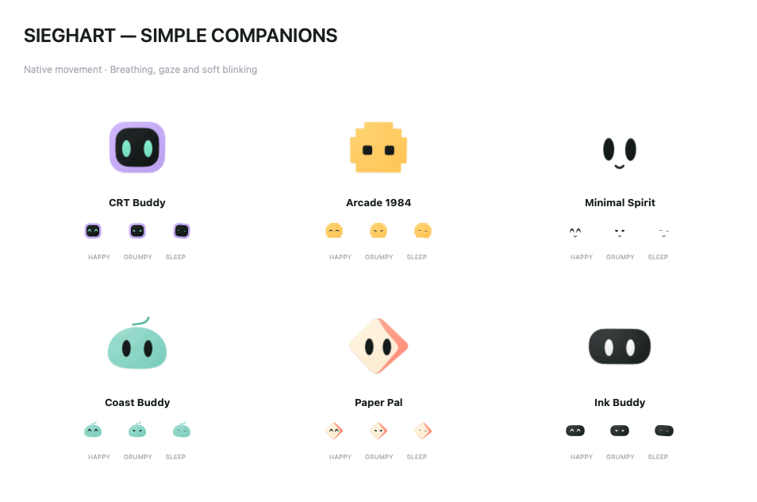
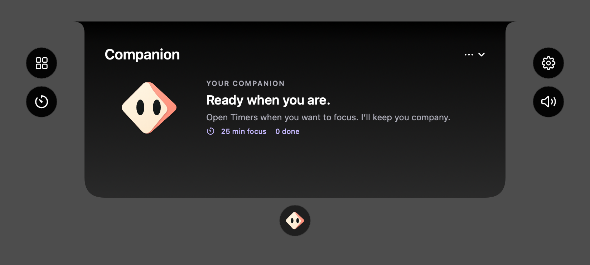
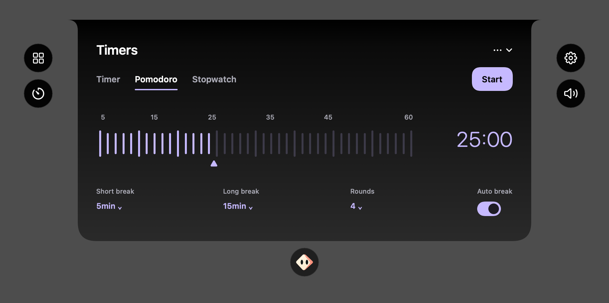
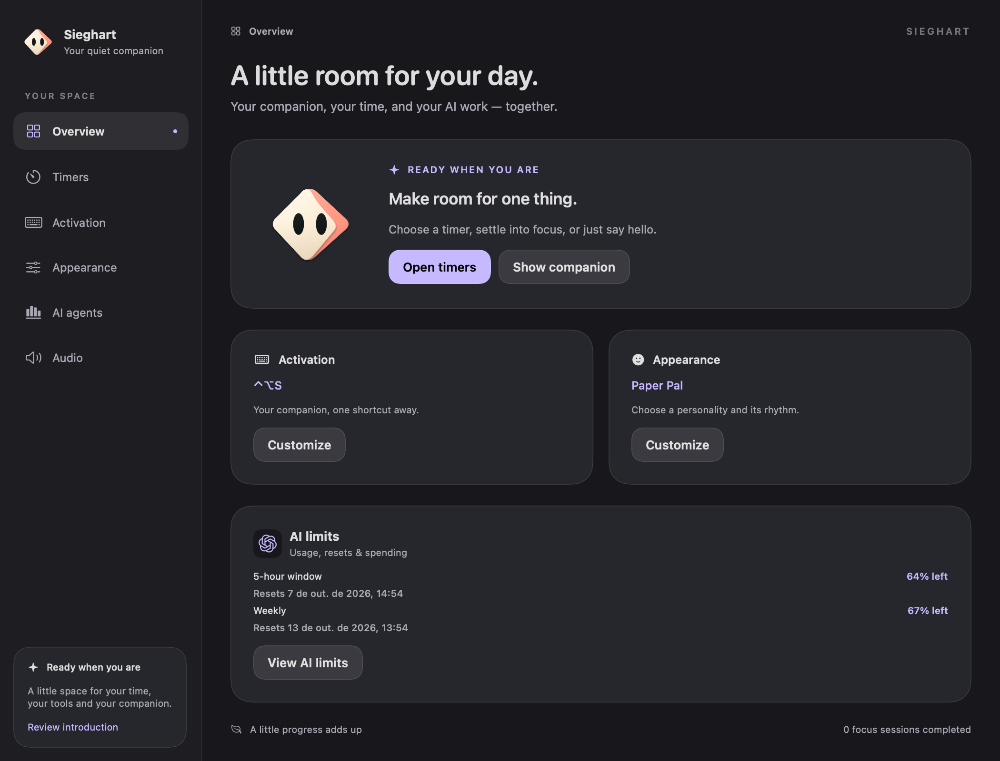
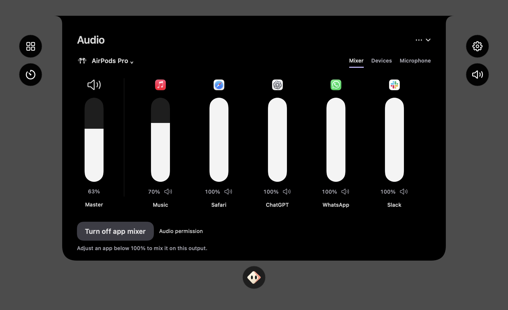
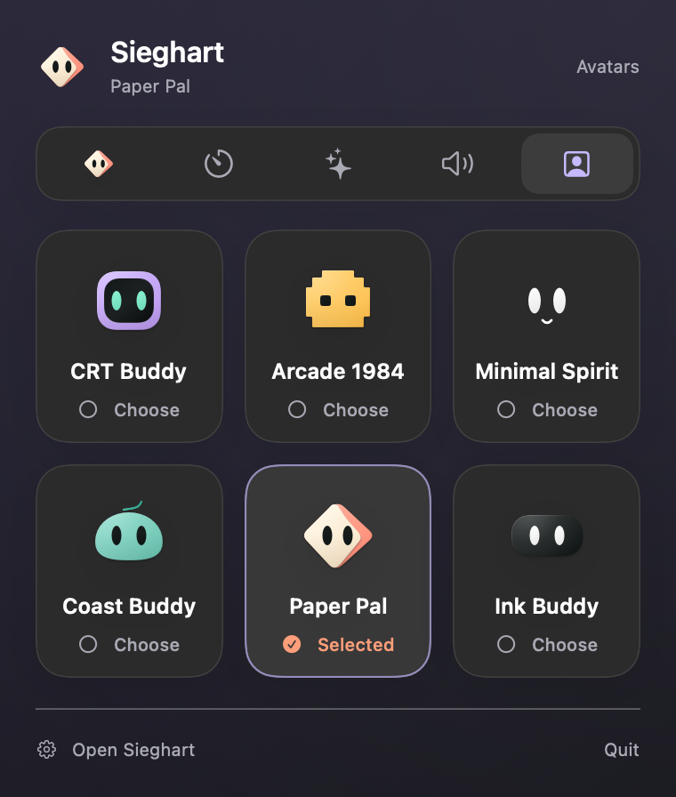
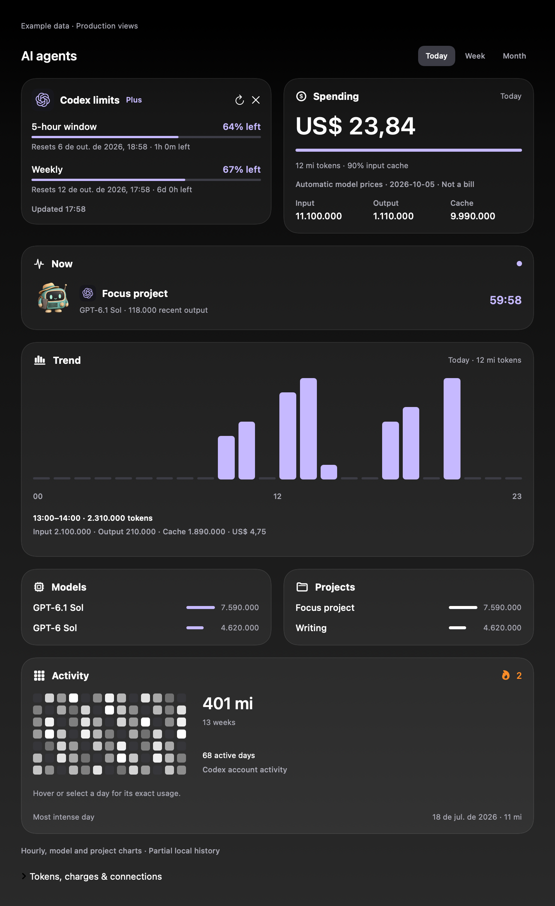

# Sieghart

### Your Mac companion, right at the notch.

[](Sieghart/Sieghart.xcodeproj)
[](Sieghart/Sieghart)
[](Sieghart/README.md)
[](LICENSE)

Sieghart is a native macOS companion that lives near the camera notch. An animated avatar reacts to your touch and pointer, while focus sessions and quick controls stay close to the top of your screen.

Choose **Timer**, **Pomodoro** or **Stopwatch** in the app’s **Timers tab**, the menu-bar Timers subpage, or directly inside the widget. Starting is explicit; the compact island keeps the countdown or elapsed time nearby while you work.

**Built toward the Swift Student Challenge.** The goal is a short, personal experience about physical interaction, an expressive companion, and calmer focus. The macOS app is the development base; Challenge packaging and hardware compatibility remain milestones.

> **In development.** The app compiles and its timer, voice-intent, shortcut, and presentation checks pass. Physical notch layout, microphone permissions, and hardware gestures still need validation on the Mac. Conversational AI is planned.

## The experience

| Feature | What it does |
| --- | --- |
| **Six companions** | CRT Buddy, Arcade 1984, Minimal Spirit, Coast Buddy, Paper Pal and Ink Buddy. Choose your companion during onboarding; change it later in Appearance or the menu-bar Avatars tab. It also becomes your menu-bar icon. |
| **Expressive reactions** | Touch brings a smile; repeated pokes make the companion grumpy, then sleepy. Tap again to wake it. Native eye expressions, smooth blinking, gaze, sleeping breath and floating “z” and short messages explain each response. |
| **Audio controls** | Master output volume, default output/input selection, supported microphone gain/mute, and an opt-in per-app mixer on the selected output. Stereo/mono Float32 routes are implemented with Core Audio process taps; real-device acceptance remains open. |
| **Menu-bar subpages** | Companion, Timers, AI, Audio and Avatars replace the long stacked panel. Avatar changes save immediately. |
| **Three timer modes** | The app and notch share a standalone countdown, Pomodoro with breaks/rounds, and stopwatch. Each supports pause, resume and reset; choosing a mode never starts a session. |
| **Dynamic island** | Matches the physical notch’s height and grows sideways. The companion strolls along the island and nudges the countdown during the final 30 seconds. Hover for a visual highlight; the first click opens controls even with another app active. The full activation strip, including the camera gap, toggles controls. Pointer exit allows 800 ms to cross between controls; keyboard reveal allows four seconds to reach them. |
| **Completion celebration** | The avatar comes down to announce completion and the break, then tucks away again. |
| **Persistent sessions** | Restores running deadlines, paused timers, completed sessions, and focus preferences after relaunch. |
| **Configurable activation** | Record separate companion and voice shortcuts, including modifier-only combinations, plus optional hover and impacts. |
| **Voice on demand** | Focus and installed-app launch commands execute automatically in English or Portuguese (for example, “open Safari” or “abra o WhatsApp”). A nod, checkmark, and message acknowledge an understood command. |
| **AI work nearby** | With one local-monitoring consent, follow Codex/Claude Code activity automatically, see limits and charts, and keep the active provider beside your avatar. |
| **Size and motion** | Choose Small, Medium or Large expanded widgets, compact timer density and character motion; macOS Reduce Motion is always respected. |

### Meet the companion


*Production native shapes based on the user-approved Simple Companions board, with matte light, soft shadow and a curved coral paper fold. Each canvas draws at its final display size for sharp edges in both the app and island. Eyes and expressions interpolate directly; no bitmap pose swapping.*



*Offscreen 20 fps preview of native gaze, blinking and breathing. The app’s motion updates at 60 Hz and respects Reduce Motion.*

First launch presents all six companions in a three-column onboarding gallery, with each name and personality. Select your initial companion and continue. Later, open **Appearance** or the menu-bar **Avatars** tab to change it. The choice saves immediately and appears throughout the main app, widget, compact island, voice, completion celebrations, menu header, and menu-bar icon. All artwork is drawn locally and works offline. Legacy sprite assets remain archived in the repository and are excluded from the app bundle. CRT Buddy remains the default.

### A companion with context



*Static renders of the production views, without opening app windows. The widget keeps only companion context inside the Buddy page. Side controls and the tool grid handle navigation; the menu bar uses five compact subpages with natural content heights.*

The compact island and camera strip stay sRGB black (`#000000`). Expanded pages offer optional Glass, an attached shoulder contour and circular quick controls around the surface. Appearance selects System, Light or Dark; separate switches control Glass in other windows/panels and in the expanded island. Both switches default off. macOS 26 uses Liquid Glass; older supported systems use behind-window blur. Reduce Transparency keeps an opaque surface. Native transitions reserve their full bounds so the moving silhouette does not resize or crop its content.



*Offscreen production-view render; glass translucency is illustrated against a sample background. Native desktop refraction and movement still require a Mac run.*

### Main app



*Offscreen render of the production main window with illustrative AI data. Overview, Timers, Activation, Appearance, AI agents, Audio and onboarding share the same glass surfaces, palette and companions. Native desktop refraction remains a Mac acceptance check.*

[Appearance](Sieghart/Design/Concepts/app-appearance-preview.png) · [Timers](Sieghart/Design/Concepts/app-timers-preview.png) · [Activation](Sieghart/Design/Concepts/app-activation-preview.png) · [AI dashboard](Sieghart/Design/Concepts/app-ai-preview.png) · [Audio](Sieghart/Design/Concepts/app-audio-preview.png)

[Sleeping motion](Sieghart/Design/Concepts/simple-companions-sleep.gif) · [Companion depth](Sieghart/Design/Concepts/simple-companions-depth-preview.png) · [Compact hover without an outline](Sieghart/Design/Concepts/compact-hover-preview.png)

[Explore the design prototype](Sieghart/Design/Prototype) · [Read the implementation notes](Sieghart/README.md)

### Audio and compact navigation



Output selection, master volume and input-device controls use Core Audio hardware properties. Devices without writable volume/mute show unavailable controls. The per-app mixer is off after launch. **Enable app mixer** opts in; the button immediately starts the public macOS system-audio permission path before enabling app sliders. A failure provides Retry and Audio permission settings. The mixer processes audio locally without saving it or recording the microphone. It shows up to five actual running apps plus Master, prioritizes apps currently playing audio, groups helpers into their visible installed app, waits for an audio connection before enabling its slider, loads native app icons, identifies the selected device (including AirPods), adjusts each with a private process tap and aggregate playback route, and restores normal playback when disabled. Stereo process mixdown supports mono Bluetooth calls and planar/interleaved Float32 outputs; encoded/incompatible formats are rejected explicitly. Real speakers, AirPods, permission denial and disconnects still require Mac acceptance.



The menu-bar panel is 380 points wide. Each tab replaces its content and fits its height, eliminating the empty 300-point content area. The island's tool grid opens Companion, Audio, AI agents, Timers, Voice, Avatars and Preferences. AI cards follow limits/spending → current work → hourly trend → models/projects → activity; hover/select a bar for exact tokens and estimated value. Connection details open separately, keeping island height bounded.

## Swift Student Challenge

The [currently published Apple requirements](https://developer.apple.com/swift-student-challenge/eligibility/), checked on October 5, 2026, call for an individual app playground (`.swiftpm`) submitted as a ZIP of up to 25 MB. The experience must work offline, include its resources locally, use English, and be experienced within three minutes. The playground must build and run with Swift Playground 4.6 or Xcode 26 or later. Requirements must be checked again for the target edition.

The main development project remains the macOS `.xcodeproj`. A submission adaptation is a separate milestone. Real accelerometer interaction remains a goal for the Challenge experience; its compatibility with an accepted playground destination still needs validation.

The judging experience should tell one clear story: meet the companion, reveal it through physical interaction, configure a focus session, and see its response. Keyboard controls and reduced motion keep the experience accessible. The core journey must work without network services, an account, or speech recognition. Voice and future integrations need a separate offline compatibility review.

## Get started

### Requirements

- macOS **14.6 or later**.
- Xcode with a **Swift 6** compiler.
- Microphone and speech-recognition permission for voice commands.
- Compatible accelerometer hardware for the optional impact gestures.

The target builds for Apple silicon and Intel. Sensor availability depends on the Mac; keyboard and hover activation are available independently.

### Run in Xcode

```sh
git clone https://github.com/AntonioPaess/Sieghart.git
cd Sieghart
open Sieghart/Sieghart.xcodeproj
```

Select the **Sieghart** scheme and **My Mac**, then run. Configure signing if Xcode requests it. The project includes the microphone usage descriptions and Audio Input entitlement.

### Start your first session

1. Complete the two-step onboarding: choose one of six avatars, then decide whether to follow local AI usage automatically. Focus works with monitoring off.
2. Click the compact island or press **Control + Option + S** to reveal the companion. Hover gives a subtle companion reaction without outlining or opening the island.
3. Open **Timers** in the app or widget. Choose Timer for a countdown, Pomodoro for focus/break rounds, or Stopwatch for elapsed time.
4. Press **Start** for the selected mode. The widget tucks into the island; click it for pause/resume/reset controls. Pomodoro also offers Finish.
5. Open **Activation** or **Appearance** in the main window to customize the experience.

The menu bar also provides access to the widget and app. In Activation, press a shortcut recorder and enter any key combination; release modifier-only keys to save. Companion and voice bindings can be disabled separately. Impact gestures are off by default.

Closing the main window with its red button keeps Sieghart in the menu bar. An app delegate retains activation independently of the window and explicitly keeps the process running after the last window closes. Window closure cancels an unfinished shortcut recorder and recovers activation; **Quit** stops the app. A listen-only session event tap handles modifier gestures across apps and restarts after interruption; regular-key hotkeys register on the system dispatcher after AppKit finishes launching. Both overlay panels elevate their level when the foreground window covers the display, and disappear on session lock/sleep. An intermittent shortcut interruption is tracked in [SG-001](Sieghart/BUGS.md). Healthy global registrations stay active across app/Space changes; permission changes or failed delivery setup trigger recovery. With an existing keyboard grant, both global delivery paths work with duplicate suppression. Closing the actual window and using both bindings in other apps/full-screen still needs a physical Mac check.

## Voice and local data

Voice starts with its configured shortcut or **Speak** in Companion/menu. Listening, transcription, feedback and Cancel/Back use the Companion page itself; there is no separate Voice page or launcher tile. The default voice shortcut is **Control + Option + V**. Saved custom modifier-only bindings remain available; Activation offers the regular-key default without overwriting them. Modifier-only shortcuts use a listen-only session event tap with Input Monitoring access, or the AppKit global monitor with existing Accessibility access. Activation provides an explicit permission button; one of those grants is sufficient. Shortcuts containing a regular key use the system hotkey API. See [Apple’s event-monitor documentation](https://developer.apple.com/documentation/appkit/nsevent/addglobalmonitorforevents(matching:handler:)).

Speak a supported command and finish naturally. Recognition completion or a short pause executes it automatically; capture stops after at most ten seconds. Choose English or Portuguese in Activation. Try “start focus for 25 minutes”, “pause timer”, “resume”, “finish”, “show”, or “hide”. Unsupported, negated, or conflicting commands leave the timer unchanged. This is a local focus-command interface; open-ended AI conversation remains planned.

Timers and preferences are stored locally in `UserDefaults`. The microphone is off while idle. Speech recognition uses Apple’s Speech framework; service availability and on-device processing depend on the language and system. See [Apple’s Speech documentation](https://developer.apple.com/documentation/speech/sfspeechrecognizer).

## Build and checks

Compile without launching the app:

```sh
xcodebuild \
  -project Sieghart/Sieghart.xcodeproj \
  -scheme Sieghart \
  -destination 'generic/platform=macOS' \
  CODE_SIGNING_ALLOWED=NO build
```

Run all deterministic checks:

```sh
bash Sieghart/Tests/run-checks.sh
```

These checks do not open the app, activate the sensor, register system shortcuts, request permissions, or record audio. They cover all three timer modes, countdown/stopwatch pause and restoration, explicit mode selection, interval counting, native first-click acceptance, activation-strip toggle, background speech authorization, voice execution and acknowledgement, shortcut persistence, modifier gestures, all six native menu icons, continuous eye/shape motion and Reduce Motion, repeated-touch reactions, wake-up behavior, exact compact notch height, island collapse, completion announcements during automatic breaks, real quota protocol fixtures, cloned-session deduplication, token arithmetic and spending persistence, AI lifecycle completion, long-turn metadata recovery, graph deduplication, first-run avatar persistence, click-only expansion, collapse of every panel, old-completion suppression, widget sizes, automatic price/tier/cache arithmetic, unpriced lower bounds and usage-based provider logos. An eighth check group exercises opt-in audio, failure states, device changes, teardown and bounded planar/interleaved Float32 mixing without using hardware.

## Project map

| Location | Responsibility |
| --- | --- |
| [`SieghartApp.swift`](Sieghart/Sieghart/SieghartApp.swift) / [`WorkspaceView.swift`](Sieghart/Sieghart/WorkspaceView.swift) | App composition, main-window navigation, glass settings and selected companion. |
| [`MenuBarView.swift`](Sieghart/Sieghart/MenuBarView.swift) | Companion header, session card, and quick controls. |
| [`NotchWidget.swift`](Sieghart/Sieghart/NotchWidget.swift) | Notch panel, companion, focus configuration, and timer views. |
| [`AssistantCore.swift`](Sieghart/Sieghart/AssistantCore.swift) | Pomodoro, countdown/stopwatch dates, rounds, and persistence. |
| [`ActivationCore.swift`](Sieghart/Sieghart/ActivationCore.swift) | Global keyboard shortcut and explicit voice commands. |
| [`KeyboardShortcuts.swift`](Sieghart/Sieghart/KeyboardShortcuts.swift) | Shortcut capture, persistence format, and modifier gestures. |
| [`VoiceCommands.swift`](Sieghart/Sieghart/VoiceCommands.swift) | Supported local voice intents and duration validation. |
| [`FocusSessionView.swift`](Sieghart/Sieghart/FocusSessionView.swift) | Three-mode timer surface and shared focus configuration editor. |
| [`VoiceCallbacks.swift`](Sieghart/Sieghart/VoiceCallbacks.swift) | Safe speech-authorization callback bridge. |
| [`DesignSystem.swift`](Sieghart/Sieghart/DesignSystem.swift) | Shared palette, controls, and appearance preferences. |
| [`CompanionAvatars.swift`](Sieghart/Sieghart/CompanionAvatars.swift) | Six native companions, interpolated eye expressions, body motion, touch reactions and the Appearance gallery. |
| [`SensorEngine.swift`](Sieghart/Sieghart/SensorEngine.swift) / [`ImpactGestures.swift`](Sieghart/Sieghart/ImpactGestures.swift) | Experimental accelerometer input and configurable gesture actions. |
| [`OnboardingView.swift`](Sieghart/Sieghart/OnboardingView.swift) | Initial six-avatar choice and local AI monitoring consent. |
| [`AIUsage.swift`](Sieghart/Sieghart/AIUsage.swift) / [`AIActivity.swift`](Sieghart/Sieghart/AIActivity.swift) | Background provider monitoring, local lifecycle/counters and spending ledger. |
| [`AIActivityView.swift`](Sieghart/Sieghart/AIActivityView.swift) | Quotas, spending, live work, hourly/model/project charts and activity heatmap. |
| [`AIUsageView.swift`](Sieghart/Sieghart/AIUsageView.swift) | Detailed counters, recorded charges and source settings. |
| [`CodexUsage.swift`](Sieghart/Sieghart/CodexUsage.swift) | Read-only Codex quota adapter, reset windows and timeouts. |
| [`Tests`](Sieghart/Tests) / [`Design`](Sieghart/Design/Prototype) | Deterministic checks and the design reference. |

## AI usage

Onboarding asks once whether to follow local AI usage. When enabled, Sieghart detects installed Codex/Claude Code and refreshes in the background using existing provider sign-in. Open **AI limits** from the sidebar, Overview, menu or widget tools; say “What is my AI limits” to open the same panel. No extra API key is required for this local adapter.

The dashboard follows the reference screenshots: quota and spending cards, current project/model/output/elapsed work beside your avatar, a 24-hour chart, model/project rankings, and a 13-week activity heatmap with streak, active days and busiest day. Reliable active work also appears automatically in the compact island. Completion clears the work indicator; a focus timer remains available.

Codex supplies real 5-hour and weekly remaining percentages, resets and dated account activity. Hourly/model/project charts use deduplicated local logs and are marked **partial local history**. Missing readings remain unavailable. Disconnect stops provider reads and automatic reconnection.

Token value is automatic: bundled model prices work immediately, then the app refreshes public [OpenAI](https://developers.openai.com/api/docs/pricing) and [Claude](https://platform.claude.com/docs/en/about-claude/pricing) tables daily and keeps the last successful reading offline. It prices each known model's input, output and cache; documented OpenAI tiers and per-request long context are considered when recorded. Internal/unidentified models keep their tokens and show an unpriced amount; a partial value uses ≥. The value is an API-equivalent estimate, not a subscription charge. [Frankfurter](https://frankfurter.dev) supplies an automatic dated USD/BRL reference rate. These public requests send no account or usage data. Custom average prices/rates remain optional overrides; actual charges remain separate. Automatic invoice imports are still planned.

Provider logos appear only when readings or usage show that provider was used. Model and project rows expose full integer totals. Hover or select an hourly bar for its range, input/output/cache tokens and value; select a heatmap day for its date and exact usage. Historical model context is recovered before the bounded log tail, including completed tasks. Absent metadata stays explicitly unattributed. Claude quotas can use a dated imported report; automatic individual Claude quota access remains an adapter milestone. Provider emblems are bundled vector assets, including the corrected OpenAI emblem for Codex; see [third-party notices](Sieghart/THIRD_PARTY_NOTICES.md).



*Offscreen production-view render with labeled example data; no live app window was opened. [Six-avatar onboarding preview](Sieghart/Design/Concepts/onboarding-preview.png).*

## Roadmap and references

[Full roadmap](ROADMAP.md) · [39 reference screenshots](Sieghart/Design/References/Widget/README.md). The roadmap covers all 77 modules in the current reference catalog, foundational onboarding/settings, and companion interactions. Planned modules are not claims of shipped functionality.

### Timer previews

[Countdown](Sieghart/Design/Concepts/timer-timer-preview.png) · [Pomodoro](Sieghart/Design/Concepts/timer-pomodoro-preview.png) · [Stopwatch](Sieghart/Design/Concepts/timer-stopwatch-preview.png). Rendered from production SwiftUI views offscreen; native desktop glass and cross-app click delivery remain Mac acceptance checks.

### Simpler companion direction

[The approved Simple Companions board](Sieghart/Design/Concepts/avatar-simple-studies.png) is now implemented as native shapes across onboarding, Appearance, island and menu. All six preserve their saved identities. Expressions, gaze and blinking interpolate continuously; breathing, listening and acknowledgement use gentle shape movement. Legacy detailed artwork is archived and excluded from app resources. See [the design brief](Sieghart/Design/Concepts/avatar-simple-studies.md).

## Useful companion options

The proposed first additions are task handoff (open a completed AI/download result) and contextual quick actions (resume a clock, select AirPods, mute an app or keep awake). Other options are a local “where I stopped” note, verified meeting audio context and opt-in gentle reminders. The user also proposes a primary companion coordinating other avatar agents, and workflows that receive a file, upload it and prepare/send email with explicit authorization. Clear, resumable steps and fewer app switches support the user's ADHD-oriented product intention. Optional selected-repository PR/build alerts follow the core utilities. These are proposals, not shipped functionality. [Concrete experiences, dependencies and boundaries](Sieghart/Design/companion-capabilities.md).

## Next steps

Sprint 3 is in progress: onboarding and the live AI dashboard are implemented. Automatic model pricing/FX, the first-click/toggle corrections, three timer modes and glass island are implemented. Visual reference influence is selective; Sieghart retains its palette, avatar role and control layout. Installed-app voice launch is implemented; browser search and invoice imports remain next. Voice now uses Companion itself; optional Glass and System/Light/Dark are implemented. Real background/full-screen shortcut acceptance remains open.

- Validate the new widget layout and voice flow on the physical Mac.
- Validate real sensor interaction in the accepted Challenge submission environment.
- Refine a three-minute, offline story with expressive interactions and accessible controls.
- Give future document interactions their own receive-and-carry animation when that feature is introduced.
- Prepare and verify the submission adaptation against the target edition’s rules.
- Continue Calendar, reminders, and conversational AI as later macOS milestones; Calendar is currently hidden.

## License

Sieghart is released under the [MIT License](LICENSE).
