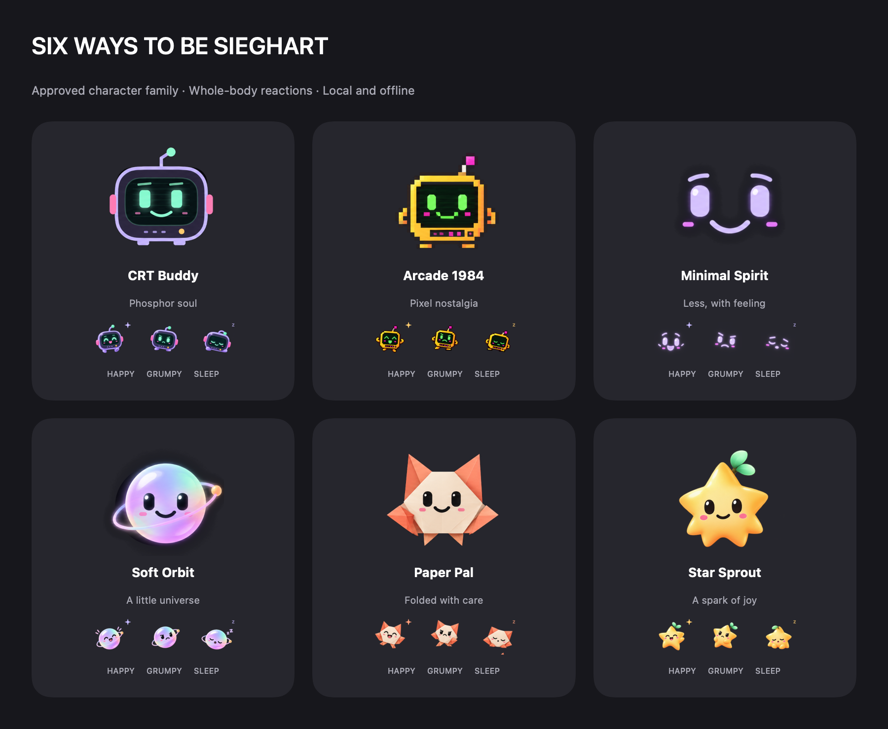
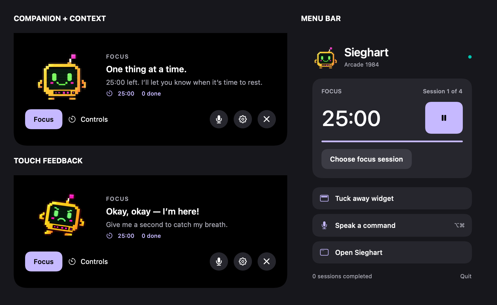
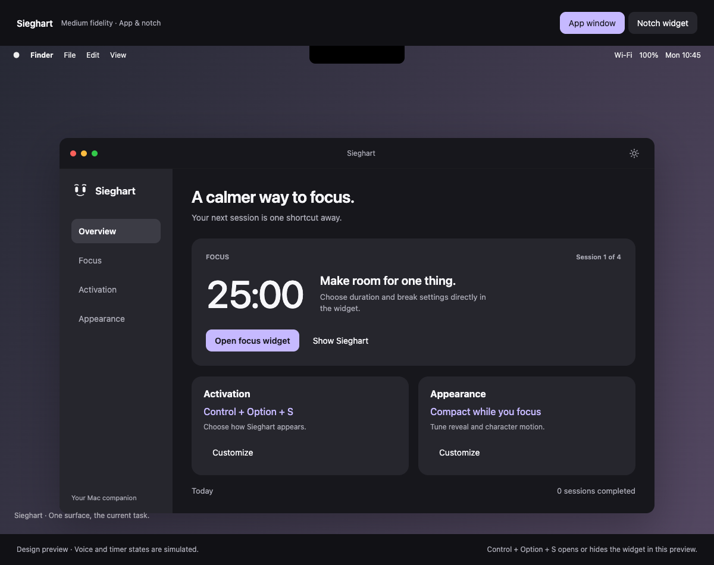

# Sieghart

### Your Mac companion, right at the notch.

[](Sieghart/Sieghart.xcodeproj)
[](Sieghart/Sieghart)
[](Sieghart/README.md)
[](LICENSE)

Sieghart is a native macOS companion that lives near the camera notch. An animated avatar reacts to your touch and pointer, while focus sessions and quick controls stay close to the top of your screen.

Configure your Pomodoro in the app’s **Focus tab** or directly inside the widget. When a session starts, Sieghart tucks into a small island around the notch, keeping its countdown nearby while you work.

**Built toward the Swift Student Challenge.** The goal is a short, personal experience about physical interaction, an expressive companion, and calmer focus. The macOS app is the development base; Challenge packaging and hardware compatibility remain milestones.

> **In development.** The app compiles and its timer, voice-intent, shortcut, and presentation checks pass. Physical notch layout, microphone permissions, and hardware gestures still need validation on the Mac. Conversational AI is planned.

## The experience

| Feature | What it does |
| --- | --- |
| **Six companions** | The original five designs are preserved, with Star Sprout added as the sixth. Choose one in Appearance; it also becomes your menu-bar icon. |
| **Expressive reactions** | Touch brings a smile; repeated pokes make the companion grumpy, then sleepy. Tap again to wake it. Body motion and short messages explain each response. |
| **Focus in both surfaces** | The app’s Focus tab and notch share duration, break lengths, rounds, and automatic break settings. |
| **Dynamic island** | Matches the physical notch’s height and grows sideways. The companion strolls along the island and nudges the countdown during the final 30 seconds. Hover or click for controls. |
| **Completion celebration** | The avatar comes down to announce completion and the break, then tucks away again. |
| **Persistent sessions** | Restores running deadlines, paused timers, completed sessions, and focus preferences after relaunch. |
| **Configurable activation** | Record separate companion and voice shortcuts, including modifier-only combinations, plus optional hover and impacts. |
| **Voice on demand** | Supported commands execute automatically in English or Portuguese. A nod, checkmark, and message acknowledge an understood command. |
| **Motion preferences** | Choose compact mode and character motion; macOS Reduce Motion is always respected. |

### Meet the companion



*Rendered from the app’s bundled artwork. The original five neutral designs are taken directly from the approved concept board; the sixth and additional poses use local transparent sprite sheets.*

Open **Appearance** and select a companion in the three-column gallery. The choice saves immediately and appears throughout the main app, widget, compact island, voice, completion celebrations, menu header, and menu-bar icon. All artwork is bundled and works offline. CRT Buddy remains the default.

### A companion with context



*Static renders of the production views, without opening app windows. The widget shows the session, time, completed count, and a companion message as soon as it opens. The menu shares the app’s palette and selected avatar.*

The widget backplate is opaque sRGB black (`#000000`), including during reveal. Its rendered pixels are verified; the physical camera glass can still look darker than a screen displaying black.

### Design reference



*Medium fidelity prototype of the main window. This image is a design reference, not a capture of the running app. The native widget has since been updated to open on the interactive avatar.*

[Explore the design prototype](Sieghart/Design/Prototype) · [Read the implementation notes](Sieghart/README.md)

## Swift Student Challenge

The [currently published Apple requirements](https://developer.apple.com/swift-student-challenge/eligibility/), checked on October 5, 2026, call for an individual app playground (`.swiftpm`) submitted as a ZIP of up to 25 MB. The experience must work offline, include its resources locally, use English, and be experienced within three minutes. The playground must build and run with Swift Playground 4.6 or Xcode 26 or later. Requirements must be checked again for the target edition.

The main development project remains the macOS `.xcodeproj`. A submission adaptation is a separate milestone. Real accelerometer interaction remains a goal for the Challenge experience; its compatibility with an accepted playground destination still needs validation.

The judging experience should tell one clear story: meet the companion, reveal it through physical interaction, configure a focus session, and see its response. Keyboard controls and reduced motion keep the experience accessible. The core journey must work without network services, an account, or speech recognition. Voice and future integrations need a separate offline compatibility review.

## Get started

### Requirements

- macOS **14.6 or later**.
- Xcode with a **Swift 6** compiler.
- Microphone and speech-recognition permission for voice commands.
- Compatible accelerometer hardware for the optional impact gestures.

The target builds for Apple silicon and Intel. Sensor availability depends on the Mac; keyboard and hover activation are available independently.

### Run in Xcode

```sh
git clone https://github.com/AntonioPaess/Sieghart.git
cd Sieghart
open Sieghart/Sieghart.xcodeproj
```

Select the **Sieghart** scheme and **My Mac**, then run. Configure signing if Xcode requests it. The project includes the microphone usage descriptions and Audio Input entitlement.

### Start your first session

1. Hover at the notch or press **Control + Option + S** to reveal the companion.
2. Open the app’s **Focus tab**, or click **Focus** in the widget, and choose your duration, breaks, and rounds.
3. Press **Start focus**. The widget tucks into the island; hover or click it to pause, resume, or finish.
4. Open **Activation** or **Appearance** in the main window to customize the experience.

The menu bar also provides access to the widget and app. In Activation, press a shortcut recorder and enter any key combination; release modifier-only keys to save. Companion and voice bindings can be disabled separately. Impact gestures are off by default.

An intermittent shortcut interruption is tracked in [SG-001](Sieghart/BUGS.md). Abandoned recording now restores activation, and registrations recover after app/Space changes and wake. The reported intermittent case still needs a physical Mac check.

## Voice and local data

Voice starts with its configured shortcut, **Speak**, or the widget microphone. The default voice shortcut is **Option + Command**, pressed and released. Modifier-only shortcuts need Accessibility permission to work in other apps; Activation provides the permission button. Shortcuts containing a regular key use the system hotkey API. See [Apple’s event-monitor documentation](https://developer.apple.com/documentation/appkit/nsevent/addglobalmonitorforevents(matching:handler:)).

Speak a supported command and finish naturally. Recognition completion or a short pause executes it automatically; capture stops after at most ten seconds. Choose English or Portuguese in Activation. Try “start focus for 25 minutes”, “pause timer”, “resume”, “finish”, “show”, or “hide”. Unsupported, negated, or conflicting commands leave the timer unchanged. This is a local focus-command interface; open-ended AI conversation remains planned.

Timers and preferences are stored locally in `UserDefaults`. The microphone is off while idle. Speech recognition uses Apple’s Speech framework; service availability and on-device processing depend on the language and system. See [Apple’s Speech documentation](https://developer.apple.com/documentation/speech/sfspeechrecognizer).

## Build and checks

Compile without launching the app:

```sh
xcodebuild \
  -project Sieghart/Sieghart.xcodeproj \
  -scheme Sieghart \
  -destination 'generic/platform=macOS' \
  CODE_SIGNING_ALLOWED=NO build
```

Run all deterministic checks:

```sh
bash Sieghart/Tests/run-checks.sh
```

These checks do not open the app, activate the sensor, register system shortcuts, request permissions, or record audio. They cover timer configuration and restoration, interval counting, background speech authorization, voice execution and acknowledgement, shortcut persistence, modifier gestures, all six sprite libraries, repeated-touch reactions, wake-up behavior, exact compact notch height, island collapse, and completion announcements during automatic breaks.

## Project map

| Location | Responsibility |
| --- | --- |
| [`SieghartApp.swift`](Sieghart/Sieghart/SieghartApp.swift) | Main window, navigation, preferences, and selected menu-bar icon. |
| [`MenuBarView.swift`](Sieghart/Sieghart/MenuBarView.swift) | Companion header, session card, and quick controls. |
| [`NotchWidget.swift`](Sieghart/Sieghart/NotchWidget.swift) | Notch panel, companion, focus configuration, and timer views. |
| [`AssistantCore.swift`](Sieghart/Sieghart/AssistantCore.swift) | Pomodoro intervals, deadlines, rounds, and persistence. |
| [`ActivationCore.swift`](Sieghart/Sieghart/ActivationCore.swift) | Global keyboard shortcut and explicit voice commands. |
| [`KeyboardShortcuts.swift`](Sieghart/Sieghart/KeyboardShortcuts.swift) | Shortcut capture, persistence format, and modifier gestures. |
| [`VoiceCommands.swift`](Sieghart/Sieghart/VoiceCommands.swift) | Supported local voice intents and duration validation. |
| [`FocusSessionView.swift`](Sieghart/Sieghart/FocusSessionView.swift) | Shared configuration editor for the app and widget. |
| [`VoiceCallbacks.swift`](Sieghart/Sieghart/VoiceCallbacks.swift) | Safe speech-authorization callback bridge. |
| [`DesignSystem.swift`](Sieghart/Sieghart/DesignSystem.swift) | Shared palette, controls, and appearance preferences. |
| [`CompanionAvatars.swift`](Sieghart/Sieghart/CompanionAvatars.swift) / [`AvatarSprites`](Sieghart/Sieghart/AvatarSprites) | Original artwork, six sprite libraries, body motion, touch reactions, and the Appearance gallery. |
| [`SensorEngine.swift`](Sieghart/Sieghart/SensorEngine.swift) / [`ImpactGestures.swift`](Sieghart/Sieghart/ImpactGestures.swift) | Experimental accelerometer input and configurable gesture actions. |
| [`Tests`](Sieghart/Tests) / [`Design`](Sieghart/Design/Prototype) | Deterministic checks and the design reference. |

## Next steps

- Validate the new widget layout and voice flow on the physical Mac.
- Validate real sensor interaction in the accepted Challenge submission environment.
- Refine a three-minute, offline story with expressive interactions and accessible controls.
- Give future document interactions their own receive-and-carry animation when that feature is introduced.
- Prepare and verify the submission adaptation against the target edition’s rules.
- Continue Calendar, reminders, and conversational AI as later macOS milestones; Calendar is currently hidden.

## License

Sieghart is released under the [MIT License](LICENSE).
