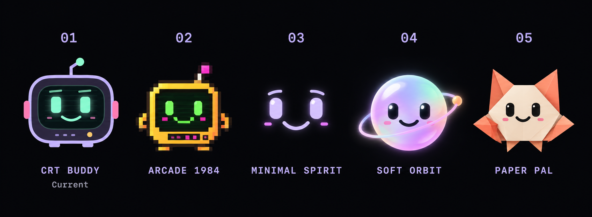

# Sieghart — Six companions

The six characters above are implemented in `CompanionAvatars.swift` and selectable in Appearance. The saved choice follows the user throughout the app, widget, menu header, and menu-bar icon. These stills render the bundled artwork; motion respects both the app setting and macOS Reduce Motion. See [the pose assets and generation prompts](avatar-reactions.md).

## Original five-direction concept board

This is the approved five-direction board, preserved unchanged. Each original neutral character is extracted directly from this board for the native app, with its backdrop removed at runtime. Additional sprite poses express new moods and body postures. Star Sprout is the only new character added to the five.

| Option | Direction | Suggested motion |
| --- | --- | --- |
| 01 — CRT Buddy | Current rounded lilac CRT, mint phosphor eyes, antenna and arcade accents. | Soft floating, blinking, pupil tracking, antenna pulse and a joyful wiggle. |
| 02 — Arcade 1984 | Amber and green pixel character with an authentic 8-bit silhouette. | Sprite hops, pixel blinks and a little victory bounce. |
| 03 — Minimal Spirit | A face reduced to expressive eyes and a smiling curve. | Small gaze changes, smooth eyelids and a restrained smile. |
| 04 — Soft Orbit | A contemporary pearl-like orb with lavender, mint and peach light. | Slow orbit, breathing volume and a listening pulse. |
| 05 — Paper Pal | Ivory and coral folded-paper creature with a warm handmade personality. | Moving folded ears, smooth blinks and joyful movement. |
| 06 — Star Sprout | Golden star with a mint leaf and warm pink cheeks. | Cheerful sway, soft blinking, gaze and a listening expression. |

All directions should remain readable in the notch, respond to touch and speech, and provide a calm state during focus. Animation must respect Reduce Motion.

## Concept brief

Method: built-in image generation. The current SwiftUI character preview was supplied as a visual reference for option 01.

Full generation prompt

Create ONE polished landscape character-design comparison board for the native macOS app Sieghart. Exactly FIVE equal columns, numbered 01 to 05 left to right. Dark near-black background, generous spacing, all five friendly mascot faces at the same visual size, consistent front view, one main character per column, simple crisp readable labels. These are alternative directions for a tiny animated avatar living in a Mac camera notch; each must remain recognizable at 32px and convey an approachable personality. This is a comparison board, not five separate deliverable assets. Input image role: reference for column 01 ONLY. Preserve its current CRT character closely: lilac rounded television shell, mint phosphor eyes and smile, subtle scanlines, angled lilac antenna with mint tip, pink small side ears, yellow status dot, tiny lilac feet. Label 01 'CRT BUDDY', subtitle 'Current'. Column 02 label 'ARCADE 1984': a genuinely different 1980s 8-bit pixel mascot, blocky amber-and-green phosphor sprite with stepped silhouette, little pixel limbs, cheeky expressive pixel face, tiny magenta highlights; flat authentic pixel art, original character with no recognizable copyrighted game characters. Column 03 label 'MINIMAL SPIRIT': dramatically reduced, elegant tiny abstract white/lilac floating face, just two expressive eyes and one subtle smiling curve, restrained rounded geometry, no robot shell, no antenna, clean and calm. Column 04 label 'SOFT ORBIT': a contemporary soft glowing pearl-like orb mascot with a lavender/mint/peach translucent gradient body, expressive dark eyes, a small orbit ring and a warm smile; simple premium volume, readable silhouette, subtle light, no complicated effects. Column 05 label 'PAPER PAL': a warm original folded-paper creature, creamy ivory and coral orange angular origami silhouette with two little folded ears/arms and a tiny expressive face, playful handcrafted personality, visually distinct from a screen or spherical character. Render each in its own appropriate art style; the five must have genuinely different forms and identities rather than recolors. Friendly subtle smile in all columns; face is the visual focus. Carefully designed compact silhouettes suitable for future animation of blinking, gaze, joyful reaction and listening. No app chrome, no computer mockup, no decorative room, no logos or watermark. English text only, labels exactly as provided.

