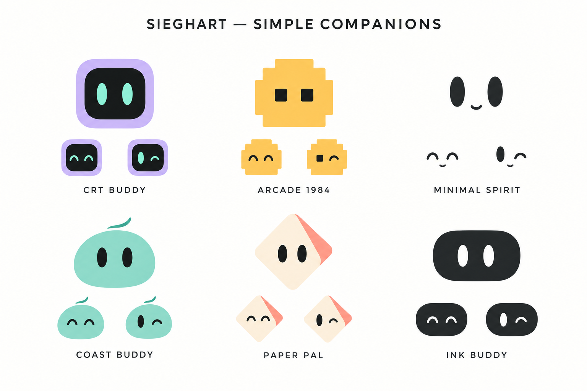

# Sieghart — Simple companion studies

## Direction

October 6, 2026: the user rejected the detailed 3D robot board and requested simple characters in the spirit of a minimal bot or expressive dots. Use small silhouettes, readable eyes, and very few details. This board preserves the six character identities while exploring that direction. It is generated concept art, not production sprites, an animation, or an approved replacement.

For the motion pass, prioritize smooth gaze, eased blinking, subtle breathing and squash/stretch for listening, acknowledgement and joy. Avoid turning a static bitmap into a rigid bouncing object. Native vector eyes and shapes can interpolate their expressions directly. Reduce Motion must preserve readable states with no continuous movement. The next art implementation should keep the user’s choice consistent throughout onboarding, the island and settings.

## Generation record

Method: built-in image generation, original image with no input reference. Output: `avatar-simple-studies.png`. The first detailed robot proposal was shown and rejected; it is not the active direction.

### Prompt

Create a NEW minimal character comparison board for Sieghart. Absolutely SIMPLE tiny desktop mascots, closer to a friendly pair of eyes in a clean small blob than a detailed robot. Flat 2D vector-like forms, no 3D rendering, no shading, no mechanical parts, no textures, no humanoid body, no articulated joints, no gloves, no shoes, no complex accessories. White/off-white page with six small characters in a clean 3 by 2 grid. Each main character uses ONE simple silhouette, TWO rounded expressive eyes, at most one tiny mouth. Maximum two flat colors per character. Let negative space dominate. Display one normal face and two tiny expression variations per cell; labels only exact names. CRT BUDDY: a very simple lavender rounded-square face with black interior and mint oval eyes, no antenna or buttons. ARCADE 1984: a very simple small amber stepped-square/pixel blob with two dark square eyes, no gamepad or controls. MINIMAL SPIRIT: just two black soft vertical oval eyes with a tiny curve, floating without a body. COAST BUDDY: a simple seafoam rounded pebble with two black oval eyes, one extremely small single-stroke cap curve as identity cue. PAPER PAL: a simple ivory/coral folded diamond silhouette with two black eyes, no origami complexity. INK BUDDY: a tiny charcoal rounded capsule with two white oval eyes, no bow tie or antenna. Friendly low-key expressions, mature minimal interface mascot, NOT toy robots, NOT Disney/Pixar, NOT fluffy 3D. Main characters should be small and readable at 24 pixels. Title 'SIEGHART — SIMPLE COMPANIONS'. Make clean polished honest minimalism, no app chrome or watermarks.
