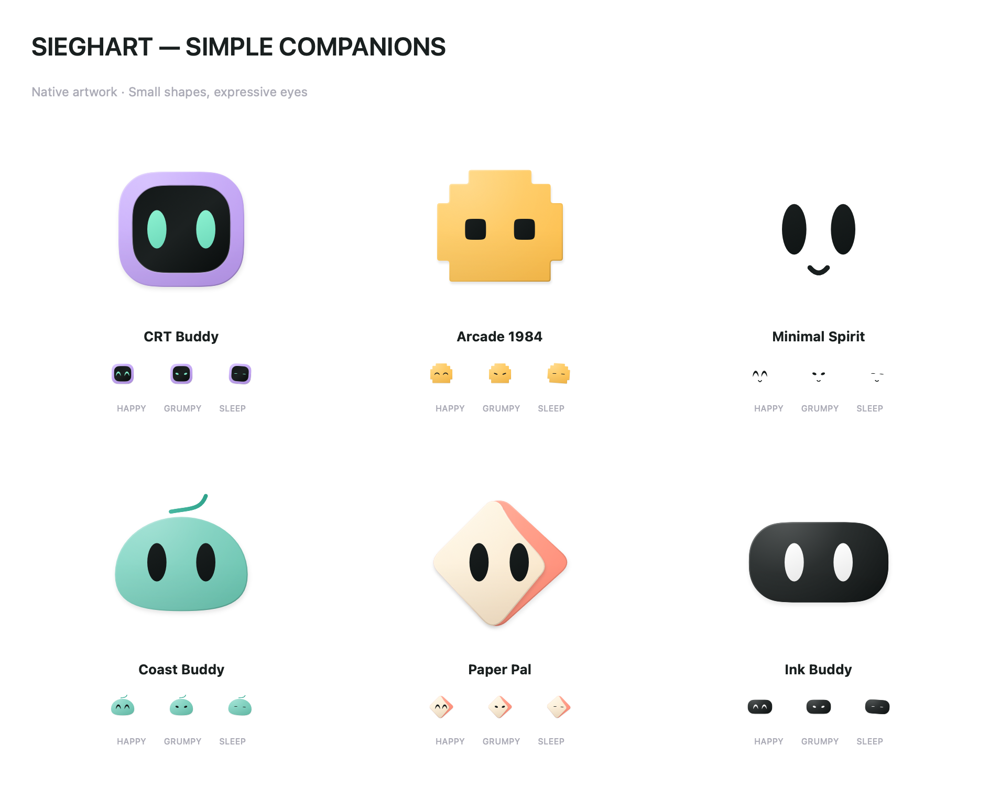

# Sieghart — Simple companion studies

## Direction

October 6, 2026: the user rejected the detailed 3D robot board and requested simple characters in the spirit of a minimal bot or expressive dots. Use small silhouettes, readable eyes, and very few details. This board preserves the six character identities while exploring that direction. The user approved this direction with “Siga por esse simple companions gostei deles.” This generated board is the visual source; the production implementation is independently drawn native paths in `CompanionAvatars.swift`. It replaces the former detailed sprite family while keeping all six stable IDs and saved choices.

Production motion uses 60 Hz sampled breathing, eased blinks, gaze and gentle squash/stretch for listening, acknowledgement and joy. Numeric eye parameters interpolate on the same path topology; the artwork does not swap bitmap poses. Reduce Motion preserves readable static states. The same native family appears in onboarding, island, settings, voice, celebration and menu icon. Legacy sprite files remain a repository archive and are excluded from the app resources.

[Native reactions](avatar-reactions-preview.png) · [Native movement preview](simple-companions-motion.gif). Both render offscreen without launching Sieghart; the GIF samples at 20 fps.

## Latest depth correction

The user supplied [this board](simple-companions-depth-reference.png) and explicitly requested depth while keeping the simple silhouettes and palette. This supersedes the flat/no-shading wording in the historical generation prompt below. Production artwork uses matte light gradients, soft layered shadows, a recessed CRT visor, a curved Paper Pal front/fold and restrained pointer perspective. Minimal Spirit remains just eyes and a small smile. No elaborate body, accessories or 3D rig is introduced.

The same artwork appears in the refreshed [main app](app-appearance-preview.png) and onboarding, alongside the native motion preview above.

## Generation record

Method: built-in image generation, original image with no input reference. Output: `avatar-simple-studies.png`. The first detailed robot proposal was shown and rejected; it is not the active direction.

### Prompt

Create a NEW minimal character comparison board for Sieghart. Absolutely SIMPLE tiny desktop mascots, closer to a friendly pair of eyes in a clean small blob than a detailed robot. Flat 2D vector-like forms, no 3D rendering, no shading, no mechanical parts, no textures, no humanoid body, no articulated joints, no gloves, no shoes, no complex accessories. White/off-white page with six small characters in a clean 3 by 2 grid. Each main character uses ONE simple silhouette, TWO rounded expressive eyes, at most one tiny mouth. Maximum two flat colors per character. Let negative space dominate. Display one normal face and two tiny expression variations per cell; labels only exact names. CRT BUDDY: a very simple lavender rounded-square face with black interior and mint oval eyes, no antenna or buttons. ARCADE 1984: a very simple small amber stepped-square/pixel blob with two dark square eyes, no gamepad or controls. MINIMAL SPIRIT: just two black soft vertical oval eyes with a tiny curve, floating without a body. COAST BUDDY: a simple seafoam rounded pebble with two black oval eyes, one extremely small single-stroke cap curve as identity cue. PAPER PAL: a simple ivory/coral folded diamond silhouette with two black eyes, no origami complexity. INK BUDDY: a tiny charcoal rounded capsule with two white oval eyes, no bow tie or antenna. Friendly low-key expressions, mature minimal interface mascot, NOT toy robots, NOT Disney/Pixar, NOT fluffy 3D. Main characters should be small and readable at 24 pixels. Title 'SIEGHART — SIMPLE COMPANIONS'. Make clean polished honest minimalism, no app chrome or watermarks.

## Final-size rendering — October 7, 2026

The latest quality report identified softened edges and insufficient material depth. Production had been drawing every Canvas at 42 points and magnifying it. It now draws at the actual view size; the remaining scale transform is only small animated breath/squash. The same paths, palette, eye interpolation and motion remain. Diffuse top-left light, clipped directional edge shading, a recessed visor and a lit paper crease improve the matte finish on white and dark surfaces.

The light board renders larger native heroes for close inspection; the same production views appear in the main app/island/menu previews. These are preview files outside app resources. No bitmap replacement or 3D rig is used.
