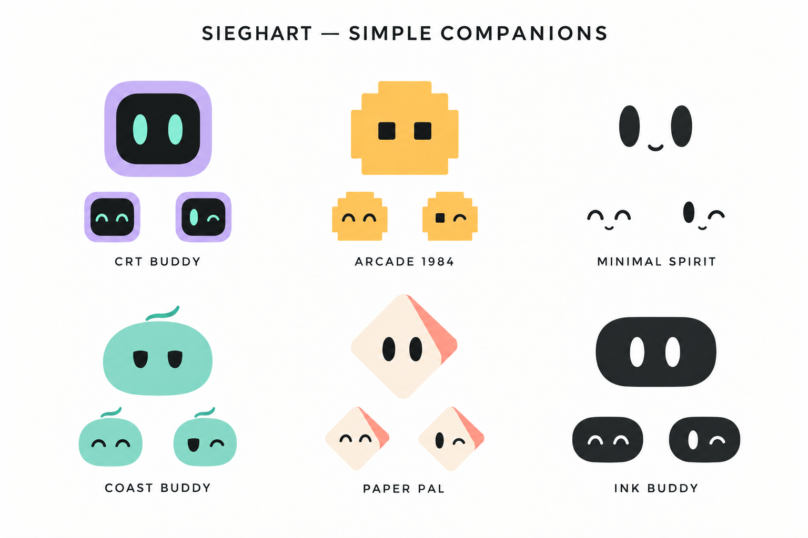
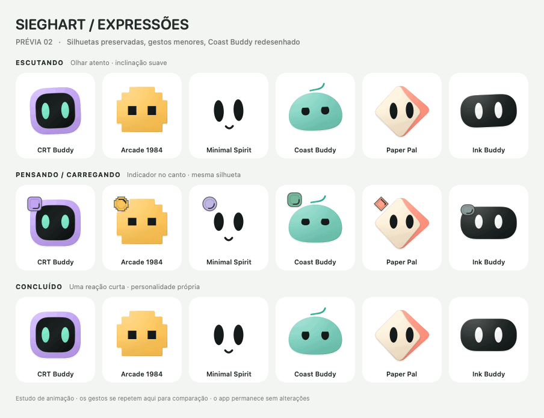

# Expressive companions — Visual review, October 8, 2026

**Preview only.** The user requested a visual proposal before changing the app. This folder is outside app resources and the Xcode source target. No production avatar, gesture, voice code or built binary was changed by this study.

## Direction and review history

- The user rejected the production floating thought dots, added listening ear and full-turn celebration. Keep the five approved silhouettes and their matte depth. Show attentive listening through gaze/body attitude; propose a small corner loading indicator that follows each character's shape and palette; give each character a short, distinct completion response.
- Loading is intended for **every real thinking/loading operation**, including recognition, searches and later task adapters, not only voice capture. A future implementation must wire verified lifecycle state, cancellation and interruption; the preview uses synthetic time only.
- Arcade retains stepped geometry, square eyes and a stepped loading badge. Paper Pal retains its fold and diamond indicator. CRT uses its rounded square; Ink uses its capsule; Minimal uses face cues. No character is replaced by a generic ball.
- The first Coast proposal with a large cap, colored headband and hair was rejected as inconsistent with the family. The user clarified that the objection was mainly to Coast. [Rejected Coast study](rejected-coast-buddy-v2.png) is history only.
- Revised Coast keeps the seafoam body/curl, subtle depth and more relaxed eyelids. Its personality is calm, cheeky and unhurried; the user's reggae/digital-nomad direction can be carried through expressions, timing and a later biography. No new clothing/body rig is required. The family image below is generated concept art, not a production resource.

## Revised previews





[60 fps native preview](expressive-study-v2.mp4) · [Coast close-up](coast-buddy-v2.png) · [Still board](expressive-study-v2.png)

Listening uses a gentle lean/attentive gaze. Thinking uses a small shape-matched corner sweep. Completion: CRT smiles and settles; Arcade has a short pixel-like lift; Minimal smiles/nods; Coast winks slowly; Paper tilts lightly; Ink gives a soft squeeze/wink. No listening ear, floating ellipsis or complete turn is used in this study. Final visual approval is pending; no implementation is implied by the rendered preview.

## Provenance and verification

Original reference: the project's approved [Simple companions board](../avatar-simple-studies.png). Built-in image generation edited the Coast cell for the concept board; other characters were requested to remain unchanged. Native study paths reuse Sieghart's own existing drawings outside the app target. A text-only review of [Coucou's state/drawing engine](https://github.com/Louis-CFM/coucou/blob/main/NotchBuddy/Sources/CoucouKit/BotEngine.swift) informed corner placement and state signaling; its source/artwork was not incorporated.

The standalone Swift study compiles and renders offscreen. The GIF is a 25 fps, four-second review loop; the MP4 is independently sampled at 60 fps. Repetition enables comparison and does not mean a future completion gesture should loop. No app, microphone, shortcuts or live adapters were started. Because this is a design-only study, production behavior suites and app builds were not repeated.

Reproduce from the repository root:

```sh
xcrun swiftc -swift-version 6 -module-cache-path /private/tmp/sieghart-study-module-cache \
  Sieghart/Design/Concepts/expressive-study-v2/StudyFace.swift \
  Sieghart/Design/Concepts/expressive-study-v2/StudyMotion.swift \
  Sieghart/Design/Concepts/expressive-study-v2/RenderStudy.swift \
  -o /private/tmp/sieghart-expressive-study-v2
/private/tmp/sieghart-expressive-study-v2 --video
```

The optional MP4 exporter uses the existing `/opt/homebrew/bin/ffmpeg`. Omitting `--video` renders only PNG/GIF without that dependency.
