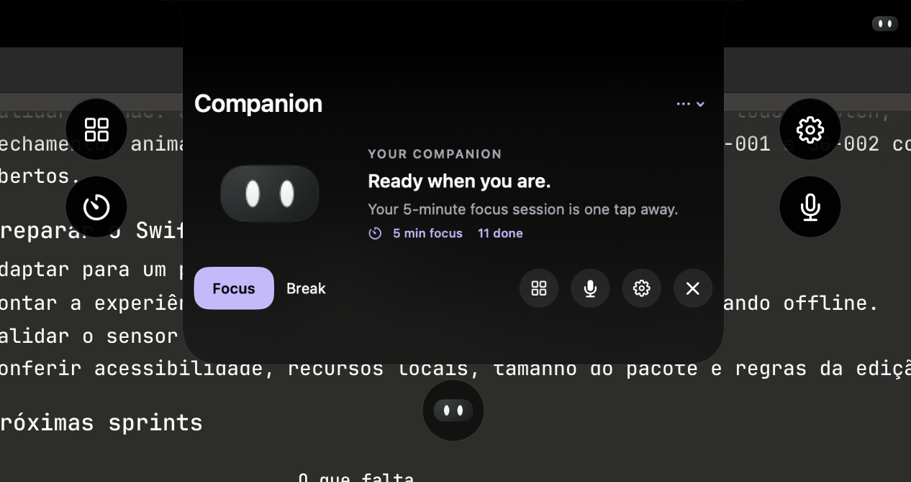
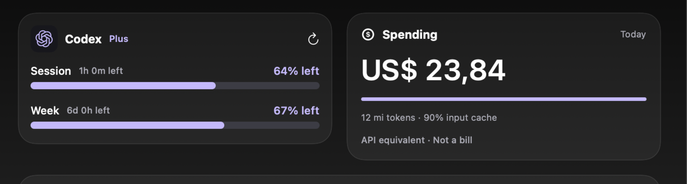
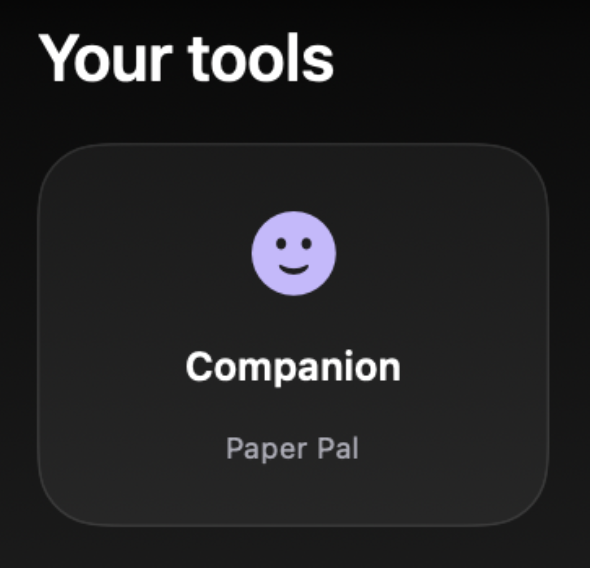
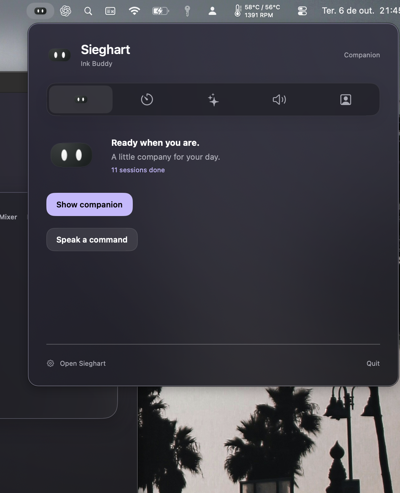
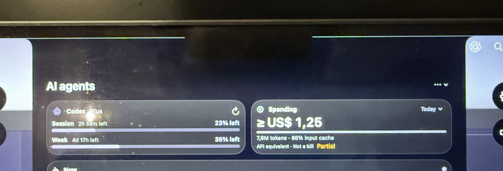
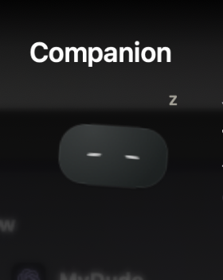

# Sieghart issue reference

The user supplied this October 5, 2026 screenshot to report the incorrect Codex emblem. The provider asset now uses the OpenAI knot matching the AI reference screenshots. See the [current dashboard render](../../Concepts/ai-dashboard-preview.png). Original screenshot pixels are preserved.

## Additional user regressions — October 5 evening

Original pixels and timestamps are preserved; [SHA-256 manifest](regressions-manifest.json).

| Capture | Report | October 6 change |
| --- | --- | --- |
| [22:14:49](2026-10-05-22-14-49-provider-summary-before.png) | Claude emblem beside Codex without Claude use | Show only providers with usage/readings |
| [22:16:53](2026-10-05-22-16-53-stale-focus-before.png) | Repeated Focus complete while working with AI | Suppress saved/old completion replay |
| [22:18:20](2026-10-05-22-18-20-model-counters-before.png) | Rounded totals and missing model attribution | Exact integers and earlier context recovery |
| [22:18:31](2026-10-05-22-18-31-hourly-chart-before.png) | Graph without useful hover data | Immediate hour/input/output/cache/value details |

The updated [production-view render](../../Concepts/ai-dashboard-preview.png) uses labeled example data and a selected hour to demonstrate details. The user's final interaction choice is click-only expansion, visual hover feedback, and collapse of every expanded view on pointer exit. Size choices are Small, Medium and Large.

## Source inspection

The pinned widget reference revision `906646178553325e76107af78ff04bf352c10adf` was inspected for AI card layout, price-source behavior, global shortcuts and island hover/click behavior. Relevant files: `NotchAgentsView.swift`, `NotchWindowHost.swift`, `NotchHoverTests.swift`, `GlobalShortcut.swift`, `AgentPriceSource.swift` and `AgentPricing.swift`. Implementations in Sieghart are independently written. Public model price facts come from official provider documentation, not an upstream code or asset copy. Installed widget reference inspection is authorized; no Sieghart/Xcode window was launched.

## October 6 presentation

[Glass island preview](../../Concepts/glass-island-preview.png) and [focus ruler preview](../../Concepts/glass-focus-preview.png) render the production views offscreen with example data and illustrative glass. Native desktop refraction and motion remain a Mac acceptance check. The app and Challenge materials use only Sieghart branding; the external research photos live in the separate [widget archive](../Widget/README.md).

## October 6 — Cramped companion layout and duplicate action row

## October 6 — Unequal quota and spending card heights

## October 6 — Generic Companion tile instead of the selected avatar

## October 6 — Menu, audio and interaction corrections

The compact menu now measures 380 points wide with natural page heights (Companion about 297 points), rather than 560 × 548 with a fixed empty area. The built bundle now contains the system-audio privacy key. Enable app mixer starts the public permission path; app sliders depend on an actual audio connection. At most five real running apps are shown, prioritizing playback, then connected apps, plus Master. The physical seam, sleep and fullscreen reports remain traceable in the bug tracker. No app/audio hardware was started by assistant verification.
