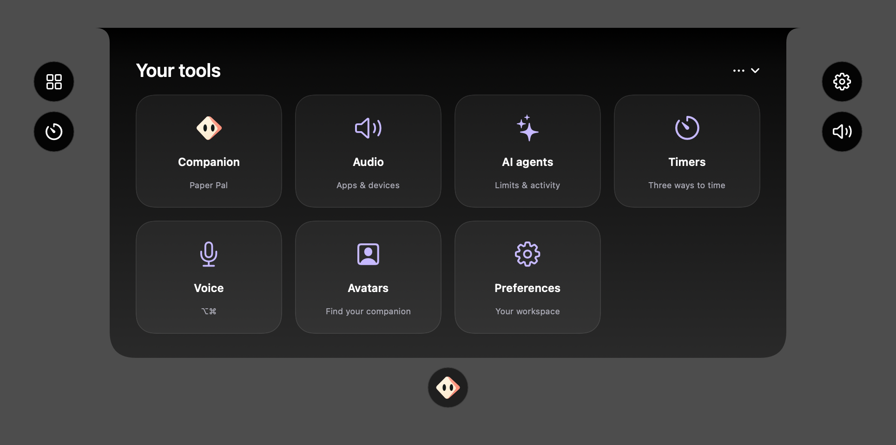
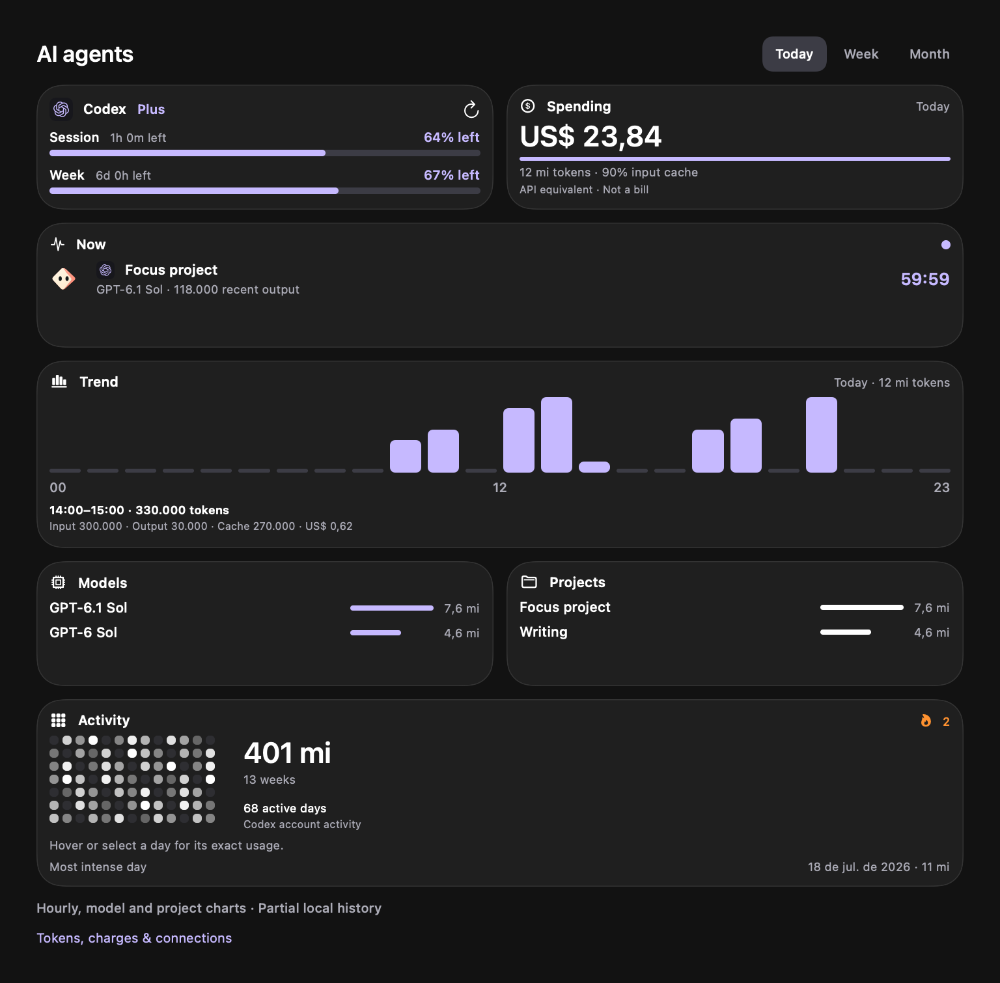

# Bounded island and menu layouts

October 6, 2026. Selective reference influence, Sieghart companions and palette. This closes the requested presentation/audio implementation round before S4; Sprint 3 and physical Mac acceptance remain open.

## Layout contract

| Surface | Base size, points | Navigation |
| --- | --- | --- |
| Companion | 620 × 240 | Context only; external quick controls |
| Timers | 720 × 330 | Timer / Pomodoro / Stopwatch; horizontal ruler and digits |
| Tool launcher | 760 × 350 | Four columns, seven implemented destinations |
| AI agents | 800 × 470 maximum | Scroll within the bounded viewport; details sheet |
| Audio | 760 × 460 | Mixer / Devices / Microphone; horizontal app columns |
| Avatar picker | 620 × 340 | Six saved companions |
| Menu-bar panel | 560 wide, content 300 high | Five replacing subpages |

Expanded island content has 44-point horizontal and 28-point vertical padding measured from the full contour. The shoulder's 16-point inset leaves 28 points of usable wall clearance. Small/Medium/Large scale the presentation; screen bounds reserve external controls. Compact camera height and black shell are unchanged. Native menu tracking counts as interaction until a choice is selected/dismissed; pointer exit then collapses normally.

## Production previews

[Countdown](Concepts/island-timer-preview.png) · [Stopwatch](Concepts/island-stopwatch-preview.png)

[Menu audio](Concepts/menu-audio-preview.png) · [Main app Audio](Concepts/app-audio-preview.png)

Images render actual production views offscreen. Example quota/token/audio data and AirPods selection are fixtures; app icons come from the installed app bundles when available. Native desktop glass, click delivery, permission prompts and playback aren't verified by these images. No app or Xcode window, live shortcut registration, sensor, microphone or system-audio capture was started.

## Audio acceptance before S4

- Master volume follows actual device state; fixed-volume devices remain explicit.
- Choose speaker/headphone output and input; device disconnects keep normal playback.
- Enable the mixer: test system-audio permission grant, denial and later recovery.
- Adjust/mute independent apps on the selected output; disable the mixer and confirm original routes resume.
- Close/reopen an audio app, switch its output, connect/disconnect AirPods, sleep/wake and relaunch Sieghart. A new launch must not enable capture automatically.
- Confirm readable sliders, horizontal overflow, submenu selection and collapse timing on all three widget sizes.

Sources are documented in AudioEngine and the installed Core Audio SDK. Device taps are available in the supported macOS 14.6 deployment range. Multichannel/encoded/incompatible formats are explicitly unsupported in this first slice. Input mute works only if the hardware exposes that property. Audio app pinning, ordering, priorities and route shortcuts remain S4.

## October 6 source review and corrections

Quota/spending cards share a fixed 96-point island / 192-point workspace outer height and equal flexible widths. Model/project cards share 96 / 162 points. The island uses the reference’s 96-point card rows and 10-point gaps; trend/activity rows allow 144 points for immediate exact hover details. Larger typography remains in the main workspace. Frames are applied before the glass surface so the visible rectangles match, including empty readings. The Companion launcher and menu-bar tab render the selected native artwork.

The reviewed reference uses fixed-height card rows, local agent log readers and owner-app icons from macOS. Sieghart retains its own parser and existing Codex account adapter: monitoring refreshes local analytics every five seconds, counters/limits every minute and account activity every five minutes. Detection is enabled by the onboarding choice; provider marks depend on observed usage or quota readings. Claude local activity is automatic; verified individual Claude quotas remain a separate Sprint 3 task. Local Codex/Claude records are distinct from browser ChatGPT conversation usage.

Audio uses public process ancestry and app bundle ownership, never a private responsibility symbol. Native installed app icons are loaded at display resolution. Core Audio supplies the actual selected device name and transport; AirPods Pro/Max and Bluetooth headphones use corresponding device symbols. Connected regular apps stay listed while silent; system daemons do not become app mixer rows. Icon reads do not start an app or capture audio.
