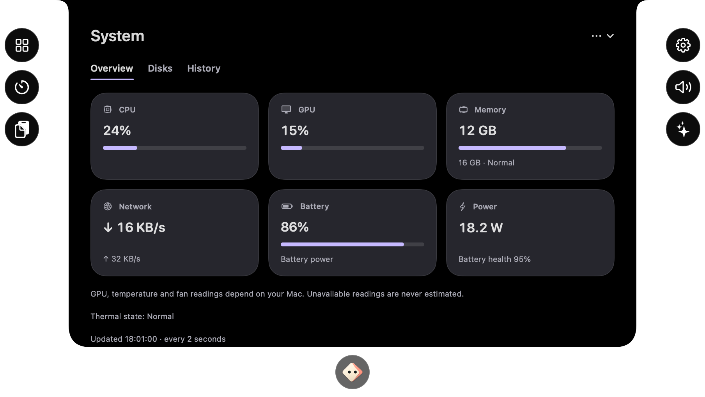

# Sprint 4 — System utilities and companion greeting

October 8, 2026. **Complete and accepted:** after `f77ac65`, the user reported “tudo funcionando”. This closes the new utility/greeting and voice/audio follow-up acceptance, separate from the earlier clipboard/editor report. [Closeout](sprint-4-closeout.md) · [Sprint 5 plan](sprint-5-plan.md). Sieghart and Xcode were kept closed during assistant development.

## Delivered

| Area | Implemented behavior |
| --- | --- |
| System | Two-second CPU counter deltas, exposed GPU utilization, app/wired/compressed memory, cache/swap detail, memory pressure and thermal state. Physical network byte rates/totals and local IPv4, mounted-volume free/capacity and exposed disk I/O, battery/charging/health/cycles/time and battery power draw, USB product names. Sixty-sample local history with exact hover readings. |
| Keep awake | Duration, future deadline or indefinite session; optional display assertion, AC/external-display/app conditions, pause/release on sleep or unmet conditions, stop/expiry/quit cleanup and opt-in restoration of valid sessions. One owned IOPM assertion, replaced only when its type changes. |
| Audio | Five real running apps plus Master, omitting Finder. Persisted favorites/order and Hide from mixer with explicit restoration; closed favorites/hidden apps never create columns. Hiding releases only that app's route and keeps saved choices. Browser XPC helpers are associated with the actual host; slider changes resolve fresh processes. UID-based output/input priorities, explicit automatic selection on connection topology changes and manual selection preserved between changes. Optional configurable global output-cycle and selected-microphone hardware-mute shortcuts share collision checks and resident dispatch. |
| Display and power | Compatible native hardware brightness, bounded software dimming with original color-table restoration, explicit display sleep, reported HDR headroom, opt-in Bluetooth device disconnect during sleep and asynchronous authenticated reconnection only for devices successfully disconnected by Sieghart. Opt-in Music launch prevention limited to a newly launched Music app within two seconds of a detected playback key. |
| Companion | Successful/error utility reactions and sustained-load/low-battery/critical-memory feedback without forcing the island open. Original native greeting: center drop, landing squash, lateral drift, brief wave, return and docking into Companion while content fades in. Runs after onboarding and optionally on app launch; tapping interrupts. Reduce Motion/Character motion off show the final state. |
| Surfaces | System, Keep awake and Display & power in the app, island page menu, tool launcher and editable rails. Menu-bar overflow opens compact subpages. Ten launcher tiles fit two rows; the launcher height is retained. Glass remains independently configurable and off by default. |

## Hardware boundaries

- GPU counters appear only if IOKit exposes utilization. Numeric CPU/GPU temperatures, fan RPM/control, per-process network traffic, speed testing and SMART health are not implemented by this base monitor. Thermal *state* is reported separately, without inventing degrees or RPM.
- Power is the battery's reported voltage/current draw, not whole-system or wall-socket measurement. Desktop Macs without that source show unavailable.
- Preventing idle sleep does not override forced sleep, battery shutdown or unsupported closed-lid behavior. Supported docked clamshell operation still follows macOS requirements.
- Native brightness dynamically resolves a Mac-only DisplayServices capability and fails closed when absent. Software dimming adjusts an owned gamma table and restores it on sleep/quit; it is not a backlight increase. HDR headroom is informational; an XDR desktop boost is **not delivered**. Private/unsupported desktop adapters require review or omission for future Challenge packaging.
- Bluetooth restoration requests a connection asynchronously; an offline/rejected device reports failure. It does not toggle the Bluetooth radio or connect devices that were already disconnected. macOS can show its real Bluetooth permission prompt when this optional feature is used.
- Music prevention needs Accessibility for playback-key observation. Existing Music sessions and ordinary manual launches outside the two-second playback window remain running. This is a narrow heuristic, not a claim to identify every possible automatic launch.
- Browser helper ownership can use the optional, undocumented macOS responsibility query when available. Missing/invalid ownership falls back to ancestry/bundle/path matching; an unknown WebKit helper is never assigned to Safari just by its name. `SIEGHART_CHALLENGE` compiles out this query. This only verifies a boundary for future packaging, not a complete Challenge-compatible app.

## Verification

Twelve isolated check groups cover the existing workflows and new counter resets/rates, bounded monitor history, assertion ownership, AC/display/app conditions, sleep/expiry/relaunch, brightness failures, dimming limits, Bluetooth ownership, Music timing, favorites/order, real-app caps, reconnect UID changes, manual output choice, shortcut collisions/persistence and interrupted contour geometry. Native artwork is sampled continuously and reduced-motion defaults are checked. Hardware adapters are injected; no real clipboard, audio, Bluetooth, display write, power assertion, microphone, sensor or shortcut is used.

The universal arm64/x86_64 app is built with CLI tools and its actual package is checked for privacy descriptions, resident-agent metadata and signature. Production UI previews use fixture readings and are explicitly examples, not captures of the user's device.

## Mac acceptance checklist — closed on the final user report

1. **System:** open the app's System page or island → System. Wait two samples, check CPU/network change with real work, memory detail on hover, Disks capacity and History tooltips. Missing GPU/power readings must say unavailable. Closing the page stops its polling when no other System surface is visible.
2. **Keep awake:** start five minutes, then Stop. Repeat with Keep display awake, a future Until time, AC-only, external-display-only and a selected app. Unplug power or quit the selected app: status should become Waiting, then resume when the conditions return. Enable Resume valid session and relaunch during an unexpired session. Test sleep/wake and expiry. Closing the settings window must keep the resident session; Quit releases it.
3. **Audio:** Finder must be absent. Play real audio, favorite/reorder apps through their icon's menu, then Hide from mixer: its row disappears and normal playback returns, while other app volumes remain intact. Restore using the eye-slash Hidden apps menu; the saved gain/favorite/order returns. Relaunch to verify hidden choices persist, and restore a closed app to verify it creates no placeholder. At most five actual apps plus Master remain. In Safari, play ordinary web audio, lower to 20%, mute, open another audio tab and verify control follows it; restore 100%. In Devices, rank connected AirPods/other devices, enable preferred devices, disconnect/reconnect and check selection. Make a manual choice and verify it stays until the device list changes.
4. **Audio shortcuts:** in the app's Audio page, record distinct Switch output and Microphone mute chords. Test with the main window closed and another app in full screen. Output cycles connected outputs; microphone mute toggles only if that input exposes hardware mute. Denied/unsupported controls must report it. Restore shortcuts remains available in Activation.
5. **Display & power:** adjust compatible Brightness; unsupported hardware offers Dimming. Adjust dimming and Restore, then test sleep/wake and Quit restoration. Sleep displays should affect the displays only. HDR text must not claim an XDR boost. Optional Bluetooth sleep should reconnect only devices the app disconnected; test an unavailable device as well. Optional Music prevention should request Accessibility and suppress a new playback-key-triggered Music launch while leaving existing sessions intact.
6. **Companion:** Finish onboarding and relaunch with Launch greeting enabled. Watch the center drop/wave/dock, tap during it, navigate to another tool while opening and reverse opening/closing quickly. No delayed greeting should replace the chosen page. Test both motion settings and macOS Reduce Motion. Utility success/failure should react without automatically starting focus or opening a dismissed island.

## Next roadmap work

The final October 8 user report closes this delivery’s release gate. Extended hardware functions listed above remain explicit backlog items. The next product sprint covers calendar/reminders, notifications, chosen-folder downloads, file shelf and capture. File receive/upload/email, connected chats and specialist agents are recorded later companion workflows; no external send is performed by this delivery.

## October 8 — Finder, hidden apps and Safari follow-up

The user reported Finder clutter, no way to remove a mixer row and ineffective Safari volume. Finder is now excluded and other rows can be hidden/restored persistently. Hiding tears down the app's gain route so it plays normally; saved gain/order/favorite remain for restoration. Hidden apps never get saved routes reapplied during refresh. The next real eligible app fills the five-column cap.

The initial owner lookup used ancestry/bundle/path alone. WebKit XPC processes can have launchd as parent and a shared helper identity outside Safari's bundle, leaving their audio outside the Safari tap. The Mac adapter now consults optional process responsibility before ancestry fallback; each volume gesture gets the current audio-object group rather than the row's old snapshot. This repairs an identified coverage gap; it is not proof that it explains every real playback failure. No Safari, microphone or audio capture was launched by the assistant.

Audio fixtures cover multiple WebKit host identities, helper/self/daemon/missing-query fallback, Safari helper replacement between polls, Finder exclusion, five-app refill, hide releasing only its route, persistence/restore, closed/hidden stale callbacks and existing permission/route/PCM checks. Both native and `SIEGHART_CHALLENGE` variants compile/run; the latter omits the responsibility lookup. Safari/app selection was subsequently accepted on the final October 8 “tudo funcionando” report; no assistant playback test was performed.

## Previews

[System app](Concepts/app-system-preview.png) · [Keep awake](Concepts/app-keep-awake-preview.png) · [Display and power](Concepts/app-display-power-preview.png) · [tool launcher](Concepts/island-tools-sprint4-preview.png) · [six-companion greeting](Concepts/companion-launch-greeting.gif).
