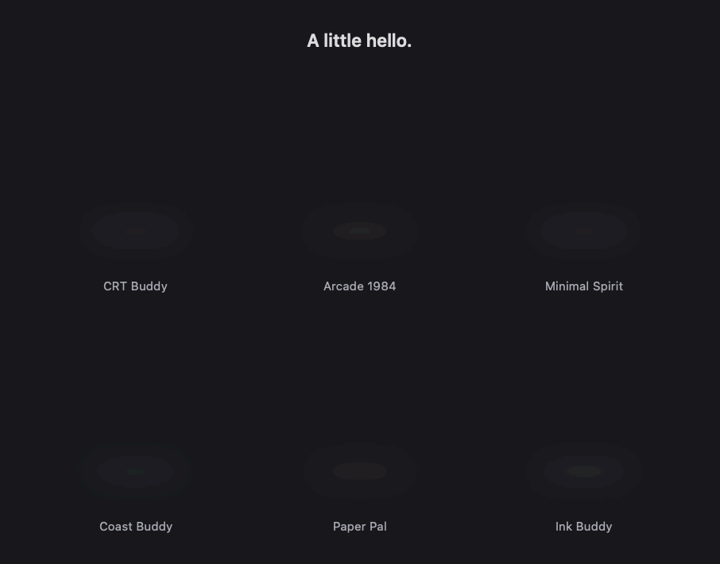

# Sieghart

## Current voice/search and architecture update — October 8

Physical source/Xcode groups use feature Views/ViewModels, Core services/helpers and reused Shared components/services/resources. [Architecture](ARCHITECTURE.md). Voice pins expanded Companion through capture, finalization and actual actions. Search accepts questions/bare topics and can recover a settled transcript after bounded drain when `isFinal` is missing; native app/timer commands retain final-only gating. Listening ear/tilt, processing dots, completed hop/turn/landing and failure gesture are native, interruptible and available to all six. [Motion preview](Design/Concepts/simple-companions-voice.gif) · [Mac checks and evidence limits](Design/voice-search-regression-checks.md). Real speech/AirPods acceptance remains open; development keeps the app closed.

The user will write the Challenge storytelling. [Three-minute judging-experience brief](Design/challenge-onboarding-brief.md) is recorded as a future onboarding gate.

## Current status — October 8, 2026

**Sprint 3 complete and accepted.** The user reported “Todos passaram” after receiving the manual acceptance instructions. SG-001 through SG-005 are resolved on that report. **Sprint 4 requested implementation is delivered:** the earlier clipboard/editor slice passed the user’s tests; system, keep awake, audio priorities/shortcuts, compatible display/power and the expanded companion greeting have twelve isolated check groups and a signed universal build. [New Mac checks and hardware boundaries](Design/sprint-4-utilities.md) define the remaining release gate. The assistant keeps the app closed; physical acceptance of these later changes remains with the user. The dated records below preserve earlier pending states as history.

The new [Coucou reference study](Design/coucou-reference.md) records future companion/task/motion ideas while keeping the six approved avatars and interaction rules. The welcome and final widget reveal now use original native choreography inspired by that study. Core utilities remain the rest of S4.

Native macOS SwiftUI companion with a configurable notch island and local Pomodoro timer.

The **Swift Student Challenge** is the primary product goal. The `.xcodeproj` is the macOS development base. The [repository overview](../README.md#swift-student-challenge) records the offline, three-minute story and submission milestone. Real sensor interaction remains a goal; compatibility with the accepted playground destination needs validation.

## App and notch

First launch shows Welcome → choose one of six avatars → optional local AI/clipboard tools. Optional voice and direct-paste access setup does not start listening. Finish saves the choices and opens Companion with its special arrival. Existing avatar choices are preselected. The offline companion/focus journey works when monitoring is declined. **Review introduction** can revisit the flow; **Appearance** or the menu-bar **Avatars** subpage changes the avatar later.

- **Overview** shows the current session and completed count.
- **Timers** opens Timer, Pomodoro and Stopwatch in the app, menu bar and widget. Pomodoro shares these settings: focus 5–60 minutes, short breaks 5/10/15, long breaks 15/20/30, rounds 2/4/6/8, and automatic breaks. Draft changes apply when starting a new session.
- **Activation** records companion, voice and clipboard shortcuts, controls hover, and exposes optional impacts and three-finger middle click. Clipboard defaults to Control + Option + C.
- **Clipboard** shares local history with the island/menu. Settings choose 5/10/20 items and age/shutdown/lid cleanup; search/pins/copy/paste and exclusions stay local.
- **Dynamic Island** uses a visual editor: the selected companion and island in the center, six clickable/draggable side positions, dashed + controls when empty, Layout presets and Small/Medium/Large cards below. Click the bottom companion to change it. Layout and size save immediately. Optional Glass has its own switch. [Design and manual checks](Design/island-layout-editor.md).
- **Appearance** selects System, Light or Dark, with two independent Glass switches (Other windows and panels / Dynamic Island), both off by default. Reduce Transparency overrides Glass. It offers six companions in a three-column gallery: CRT Buddy, Arcade 1984, Minimal Spirit, Coast Buddy, Paper Pal, and Ink Buddy. Selection saves immediately and applies throughout the app and notch. Edit layout links to Dynamic Island. Timer density, character motion and reduced motion remain configurable; compact height follows the physical camera cutout. macOS Reduce Motion is always respected.

Normal reveal opens the selected avatar beside a contextual message and session time. Speak uses this same panel for listening, transcript and feedback. The user-approved Simple Companions family is drawn with native paths: lilac CRT square, amber pixel silhouette, floating eyes, seafoam pebble, folded diamond and charcoal capsule. Numeric eye/shape parameters interpolate blinks, gaze and moods; subtle breathing, listening pulses, nods and squash/stretch add movement. All six keep their stable saved identities. Native renders also supply the selected menu-bar icon. Legacy sprite sheets are archived in the repository and excluded from the app bundle.

The first three quick touches produce a happy expression and gentle hop, the fourth brings a grumpy shake, and the fifth sends the companion to sleep. One more touch wakes and stretches it. Each reaction has a short written response. Sleep lasts until another touch; taps separated by more than three seconds start a new burst. Custom interactions retain keyboard and VoiceOver actions with a rounded focus indicator, avoiding the native rectangular mouse focus ring.

Starting a session tucks the widget into a small island. Its height matches the physical camera cutout exactly; it grows horizontally, leaving the camera area clear. Displays without a notch use a 36-point island. The companion strolls occasionally in the free lateral space. During the final 30 seconds it appears beside the countdown, nudges the digits, and shows “Almost!”. Hover gives a visual highlight; only a click expands controls. Leaving expanded pages such as AI, tools and setup collapses them after an 800 ms crossing allowance. Voice preparation, listening and finalization keep expanded Companion visible until they finish or are explicitly cancelled. Keyboard reveals allow four seconds to reach a control, and entering cancels that timeout. Pointer departure during active voice preserves capture and the expanded transcript. Explicit shortcuts and impacts remain available. Impact reveal also opens the companion from the compact state. Native panel bounds are controlled explicitly; the hosting view cannot retain an earlier view’s size constraints.

The compact island and camera strip use opaque sRGB black. Expanded pages use solid surfaces by default. The saved Dynamic Island switch enables native glass/behind-window blur, with an opaque Reduce Transparency fallback; Light/Dark follow the selected app appearance. The moving contour keeps content at a stable layout. Physical camera glass and the display can still differ in apparent black level. Walking, nudging, bouncing, and other motion pause when character motion is disabled or Reduce Motion is enabled.

The menu shares the app’s selected appearance and optional Glass, rounded controls, selected avatar, session card, progress bar, and voice shortcut hint.

The widget and hover zone are nonactivating floating panels with `canJoinAllApplications`, `canJoinAllSpaces` and explicit `fullScreenAuxiliary` capability. Native panels preserve their requested camera-band frame rather than being constrained to the menu-bar safe area. They restore ordering when the active Space or application changes, including full-screen apps, without activating Sieghart or reopening a dismissed companion. This follows [Apple’s overlay collection behavior](https://developer.apple.com/documentation/appkit/nswindow/collectionbehavior-swift.struct/canjoinallapplications). Full-screen transitions and hover behavior still need a physical Mac check.

A saved or previously announced completion never reopens on hover, navigation or relaunch. Every newly completed interval emits a separate completion event. The widget expands with a bouncing avatar, orbiting sparkles, and a clear completion message, including when a break starts automatically. After five seconds it tucks away if the pointer is outside; hovering keeps the message available. The break countdown continues during this announcement. Manual Finish offers a break action. Completed breaks invite the next focus session.

Timer deadlines, paused state, interval type, configuration, rounds, and completed count survive relaunch. Focus counts once; breaks never increase that count. Long breaks follow the last round. Expired sessions finish once after relaunch and wait for the user before starting another interval.

## Shortcuts and voice

The companion defaults to **Control + Option + S**. Voice defaults to **Control + Option + V**, using the system global hotkey without keyboard monitoring access. Explicitly saved modifier-only chords are preserved; Activation offers a button to use the default regular-key chord. Record any key combination in Activation; modifier-only chords are saved on release. Escape cancels recording. Bindings persist independently, can be disabled, and cannot use the same chord. Existing companion shortcut choices migrate automatically.

Regular key combinations use Carbon hotkeys. Modifier-only shortcuts prefer a listen-only CG session event tap with Input Monitoring access. Existing Accessibility access can instead use local/global AppKit monitors. Only one grant is needed; the permission button requests Input Monitoring only when neither grant exists. The session tap runs in common run-loop modes, reenables after interruption and also routes regular-key combinations even if Carbon registration succeeded, with a per-action gate preventing two backends from toggling twice. Activation offers the permission button and displays availability. Using a regular key or an extra modifier suppresses a modifier-only trigger. No keyboard text is recorded or logged.

Leaving a shortcut recorder cancels unfinished capture and restores activation. Healthy registrations stay installed after app and Space changes, wake, display wake and unlock. These transitions clear stale modifier state and check health; only abandoned recording, permission changes or failed setup cause registration changes. Carbon installs its handler on the dispatcher target. A two-second health check observes permission and secure-input changes and retries failed setup without changing the saved bindings. The intermittent failure report remains tracked in [SG-001](BUGS.md) pending physical Mac validation.

Voice starts explicitly through its shortcut, Speak, or the microphone button. Choose English or Portuguese. The app requests microphone and speech access, listens until roughly 1.4 seconds of audio quiet or a final recognition result, then drains the recognition task before dispatching a supported command once. Capture stops before execution; capture safety/input-loss paths run nothing; a bounded stable-search recovery handles a missing final result, while app/timer actions never execute partial text. Cancel remains available; the microphone is off while idle.

Supported intents include starting focus with a valid duration, pause, resume, finish, reset, start break, show, hide, configuration, AI limits and opening an installed app by its exact name and browser search in English/Portuguese. “Search for Swift tutorials” or “pesquise receitas” opens a DuckDuckGo query in the default browser. URLComponents safely encodes the query; query words never trigger additional actions. A successful command gets a nod, green checkmark, and “Got it.” message. Negation, conflicting actions, and unsupported durations are rejected. This is a bounded local command interface; open-ended conversation remains future work. On-device speech is preferred when supported, but language and system availability can require Apple services. The timer and core interaction work independently of speech.

Speech authorization uses a Sendable callback bridge. Audio tap writes are serialized through a thread-safe feed that closes on teardown. Recognition results cross to the main actor as primitive text and status values. The signed target retains its Hardened Runtime Audio Input entitlement.

Impact gestures are off by default. Enabling them activates the experimental accelerometer reader and configurable one/two/three-impact mappings. Availability depends on Mac hardware.

Calendar is temporarily hidden. `CalendarContext.swift` remains for later repair; saved Calendar impact mappings fall back to revealing the companion.

## AI adapters

`AIUsageModel.startMonitoring` runs independently of whether the AI panel is open. With saved consent, installed Codex/Claude Code detection runs at most once per minute. Cached local lifecycle metadata refreshes nominally every five seconds; quota/counter work runs on the minute cycle and quota requests coalesce for five minutes. Codex account activity refreshes every five minutes. Requests can delay a polling cycle. Disabled providers are removed from displayed activity; disconnect also disables automatic reconnection. In-flight counter results are discarded after disconnect.

Codex access uses `account/rateLimits/read` and `account/usage/read` through the installed CLI app server and existing sign-in. Requests time out after twelve seconds. The app never starts a model turn or resets a quota. Percentages show **remaining** usage, and window names come from returned durations. Expired/missing values remain unavailable. Credentials stay within Codex. Account activity supplies dated daily buckets and a reported streak when available; failed refresh preserves a visibly dated last successful reading.

Numeric counters and activity metadata come from recent `.codex/sessions` and `.claude/projects` JSONL files. Discovery is bounded to 5,000 candidate files and processing to 80 recent files/provider. Counter parsing reads the final 2 MiB. Activity also inspects the initial 64 KiB for project metadata. When a recent Codex turn begins before the tail, a cached, bounded reverse search can inspect up to 256 MiB of older lifecycle/context records. Unchanged files are not reparsed on every poll. Only timestamps, counters, model, project basename and lifecycle are retained; no prompt, response, tool arguments or credentials are retained or logged.

Codex cumulative counters/cloned rollout IDs and Claude streamed message IDs are deduplicated. Cache and reasoning are not added twice; Claude cache creation is accounted for separately in estimates. A recent modified file alone is not proof of active work: start/completion events govern the badge, with a five-minute freshness limit. This is **partial local history**, not full account lifetime usage.

The shared dashboard provides quotas, spending, current work, 24 hourly bars, exact model/project counts and a 13-week activity heatmap. Hover/select hourly bars for immediate range/input/output/cache/value detail, or a day for its exact dated count. Summary emblems and provider choices follow usage evidence rather than mere installation. Older model context is recovered for completed histories as well as active work, without relabeling earlier counters with a future context. Account daily activity is used when supplied; otherwise the heatmap has the partial local source label. Missing days are marked **No record**. Active work appears beside the selected avatar in the compact island and opens the complete AI panel, while preserving active focus. The island retains the camera gap and physical notch height. [Dashboard preview](Design/Concepts/ai-dashboard-preview.png) and [onboarding preview](Design/Concepts/onboarding-preview.png) use labeled sample fixtures in production views.

The local ledger holds dated subscription/API charges separately in USD and BRL. `ModelPricing.swift` loads bundled numeric provider price facts and fetches official OpenAI/Claude Markdown tables daily while monitoring is enabled. Valid updates persist locally; changed/invalid tables retain the last good cache. Requests are bounded and time out. Standard prices are the default; a recorded supported OpenAI tier selects its table. Long-context rates apply only to a known individual request, never an aggregate. Claude cache-write duration is accounted for when logged. Unknown/internal models stay unpriced, with all their tokens retained and a ≥ lower bound for the priced portion. Optional custom averages override this explicitly. The USD/BRL reference rate is fetched from Frankfurter and displayed with its source date; a dated custom rate remains available. These requests send no local usage or account identifiers. API-equivalent value is not an invoice; actual CSV/JSON charge imports with review/deduplication are implemented (see [format](Design/charge-imports.md)). Claude individual subscription percentages read the desktop app’s local plan history automatically, with a 30-minute freshness limit and no inferred reset date. A JSON report can also supply a dated reading:

```json
{
  "capturedAt": "2026-10-05T21:00:00Z",
  "primary": {"usedPercent": 25, "windowDurationMins": 300, "resetsAt": 1791244800},
  "secondary": {"usedPercent": 40, "windowDurationMins": 10080, "resetsAt": 1791763200}
}
```

Source protocol: [Codex app server](https://learn.chatgpt.com/docs/app-server). Provider asset attribution: [third-party notices](THIRD_PARTY_NOTICES.md). User reference screenshots: [39-image gallery](Design/References/Widget/README.md).

## Verification

From the repository root:

```sh
bash Sieghart/Tests/run-checks.sh
```

Thirteen groups cover timer behavior and restoration, background speech callbacks, PCM endpoint/drain unit checks, capture-to-command integration with injected framework events and Google/app/timer launches, expanded busy-voice visibility, voice acknowledgement, shortcut persistence and modifier gestures, all six native icons, deterministic reduced-motion states and continuous blink samples, persistent avatar selection, repeated-touch moods and waking, exact compact notch height, expanded-control collapse, completion announcements during automatic breaks, real quota/activity protocol fixtures, token/stream/clone deduplication, live-island transitions, long-turn metadata recovery, cache creation and onboarding persistence. They use isolated preferences and a headless controller: no app windows, sensor, microphone, permission requests, or system shortcut registration.

The generic signed macOS build covers `arm64` and `x86_64`. Physical notch fit, recording a shortcut in the UI, permissions, real microphone recognition, animation feel, and impact hardware still require a user run on the Mac.

## October 6 correction evidence

All seven deterministic check groups passed, including click-only island behavior, every expanded presentation's pointer exit, old completion suppression, persisted widget sizes, shared global/foreground event routing, long completed-history model attribution and per-model/tier/cache estimates. A universal signed build succeeded for arm64/x86_64 and its signature verified. Live public-source verification parsed OpenAI/Claude price tables and the October 6 USD/BRL quote; no account data was sent. [User regression captures](Design/References/Sieghart/README.md) preserve the four additional bug reports. Real foreground-app/Spaces shortcut delivery and physical notch behavior still require the user's Mac acceptance.

## Island presentation

`IslandChrome.swift` owns the independently authored shoulder contour, glass/blur fallback, translucent cards, local button feedback and native canvas. The canvas reserves both transition sizes, animates its contour without resizing the content, then returns the window to the settled bounds. Closing removes the page before contracting the shell. Compact/camera pixels stay black; Reduce Motion and Reduce Transparency are respected. External source code and reference branding are not part of the app or Challenge package.

All six Simple Companions retain their saved identities. Native paths morph their eye expression and gaze; body motion updates at 60 Hz, with cosine blinks/hops and spring expression changes. Reduce Motion preserves static readable states. [Production reaction stills](Design/Concepts/avatar-reactions-preview.png) and [native movement preview](Design/Concepts/simple-companions-motion.gif) are rendered offscreen; the GIF is sampled at 20 fps.


## October 6 — Click regression and three timer tools

The native activation strip now accepts the first mouse event from another app, uses the complete compact island width, and toggles expansion/collapse through one synchronous route. SwiftUI hosting explicitly accepts first mouse too; compact button labels give transparent spacing the same hit target. The strip stays above the panel only in the camera-height band. Hover highlights without expansion, and pointer exit collapses every expanded page. SG-002 remains a physical-Mac acceptance gate.

The app's Timers tab and widget offer Timer, Pomodoro and Stopwatch. Countdown duration is 1–180 minutes with presets. Stopwatch displays tenths and hours after an hour. Dates preserve running/paused state across sleep/relaunch; utility clocks never increment focus rounds. Selecting a mode changes only the selected page. Pause/reset keep the timer controls visible. Pomodoro retains its configurable focus/break rounds and completion notice.

Selective reference influence is the current design direction. Use useful glass/cards and timing interactions while retaining Sieghart's visual identity. New character studies should be minimal eye/dot/visor designs; the detailed 3D robot proposal was rejected. [Simple concept board](Design/Concepts/avatar-simple-studies.png) was approved by the user and now supplies the production native character direction. [Timer previews](Design/Concepts/timer-timer-preview.png) render offscreen.


## October 6 — Simple Companions and interaction follow-up

The full activation header spans the current island width, including its camera gap. Native hit testing treats the center and wings equally. A bounded global mouse-down fallback handles camera-area clicks routed by the WindowServer to another app; it sees only the pointer point inside this rectangle. Native windows accept first mouse and preserve their full screen-edge frame. A visible-only pointer check bridges missing camera tracking events. Keyboard reveals have four seconds of approach grace; pointer exit allows 800 ms. Entry cancels collapse; manual closure still acts immediately. Timer completion keeps its separate announcement deadline.

Global shortcut registrations remain intact across foreground/Space transitions. Carbon uses the application event target. Existing authorized session/AppKit monitoring routes ordinary-key shortcuts as well as modifier gestures, with duplicate backend suppression. Both overlay panels declare full-screen auxiliary capability in addition to cross-app/all-Spaces placement. These changes are covered by isolated routing and timing checks; actual full-screen event delivery, physical camera clicks and movement still require Mac acceptance (SG-001/SG-002).


## October 6 — Companion depth and main-window design

The latest user reference retains minimal shapes while requiring visible depth. Matte gradients, soft layered shadows, a recessed CRT face and a curved ivory/coral Paper Pal fold now give the six native characters volume. Subtle gaze perspective respects Reduce Motion; this is 2.5D artwork, not a 3D character rig. The original palette and stable saved identities remain.

The main app now shares its selected appearance and optional Glass across Overview, Timers, grouped Activation preferences, Appearance, AI limits and onboarding. Overview reflects the active clock and keeps focus explicit. The compact island no longer draws its colored hover contour or native edge: feedback is a small character reaction on the unchanged black shell.

[Main-window preview](Design/Concepts/app-overview-preview.png) · [Appearance](Design/Concepts/app-appearance-preview.png) · [Depth](Design/Concepts/simple-companions-depth-preview.png) · [Borderless compact hover](Design/Concepts/compact-hover-preview.png). Production views are rendered offscreen with illustrative data; no app window, real shortcut, sensor or microphone was started. SG-001/SG-002 remain physical Mac acceptance checks.

## Before Sprint 4 — Bounded layout, menu subpages and audio

Companion context now has contour-aware margins without the repeated inner action row. The launcher is a four-column grid with the saved native avatar in Companion, timers place the ruler and clock side by side, and AI cards preserve the compact reference order. Expanded island heights stay bounded; connection details open separately. Native menu tracking keeps the parent island available while selecting a submenu item.

Menu-bar Companion, Timers, AI, Audio and Avatars tabs use a 380-point panel with natural content heights. The Companion page is about 297 points high, down from 548. Compact timer/audio controls fit the reduced width. Change the saved companion there without opening the main window. The main workspace also includes Audio.

`AudioEngine.swift` independently implements hardware properties and private per-app Core Audio taps/aggregate playback. At most five real regular running apps appear alongside Master, with currently playing and connected apps first. A row without an audio connection is unavailable until the app produces audio; no placeholder apps or ineffective taps are created. Icons come from actual app bundles; device names/transport identify AirPods. Process mixdown includes all output streams from the chosen app and routes them onto the chosen output. Float32 PCM supports stereo/mono and planar/interleaved playback; a Bluetooth call folds stereo to mono without changing sample timing. Unity gain is normal passthrough and destroys its tap. Process death/output changes tear down routes. Unsupported formats fail explicitly; a failed replacement retains the previous route.

The October 6 report revealed that the generated Info.plist omitted `NSAudioCaptureUsageDescription` despite its build setting. `Sieghart/Info.plist` now supplies that key and is merged into both build configurations. Enable app mixer starts a temporary private, unmuted tap-only aggregate through public Core Audio APIs on a worker task, before restoring gains/enabling app sliders. The probe includes no app processes, no physical input/output devices and retains no audio. Requesting/permission failure/retry/settings are explicit; cancelling an outstanding request cannot enable mixing afterward. Each new launch starts with mixing off. Verification checks the privacy key in the **built bundle**, not just project settings.

The app is declared as a menu-bar agent (`LSUIElement`), with the normal workspace opened from its menu. Overlays remain nonactivating and eligible for other apps’ full-screen Spaces. Carbon handlers use the application event target; an authorized event tap accepts existing Accessibility or Input Monitoring access and invalid ports are rebuilt. This corrects input/visibility setup but does not claim the repeated physical full-screen report closed. The native island top edge overscans one backing pixel; its contour stroke and custom focus outline are removed. Keyboard focus keeps subtle surface feedback.

Installed-app voice commands resolve exact local names and known bundle aliases, reject ambiguous/multi-action requests and never execute shell text. Sleep animation breathes, sways gently and floats a fading “z” for all six companions. Reduce Motion/disabled character motion preserve still artwork. [Sleep preview](Design/Concepts/simple-companions-sleep.gif).

The audio checks use a mock backend and allocated sample buffers, covering the actual enable handshake through mocks, denial/retry/cancel, waiting apps, the five-app cap, failure, mute, output changes, teardown, persistence and stereo/mono/planar bounds. They do not validate physical playback. Speakers/AirPods, grant/denial, app restarts, unplugging devices, sleep/wake and latency are mandatory Mac acceptance before Sprint 4. Audio pinning/order/device priorities remain S4.

[Layout notes and current previews](Design/island-layout.md). Reference photos stay outside app/Challenge resources. See [Apple’s Core Audio tap documentation](https://developer.apple.com/documentation/coreaudio/capturing-system-audio-with-core-audio-taps).


After a CLI build, run `bash Sieghart/Tests/verify-built-app.sh /path/to/Sieghart.app` to check built privacy descriptions, agent metadata and signature without launching the app.


## October 7 — Resident activation and native-size companion rendering

Closing the main window with its red button must leave both shortcuts available. `ResidentAppDelegate` retains activation independently of the settings scene and explicitly keeps the process running after the last window closes. Window-close/hide recovery clears unfinished shortcut recording. Explicit Quit still terminates. Isolated tests post a close event and deliver companion activation through both routing backends; actual window closure and voice/full-screen acceptance stay open in SG-001. No background helper or login-item registration was introduced.

The character Canvas previously drew at 42 points and then scaled to each display size. `CompanionFace.renderSize` now supplies the real size, including native menu icons. The animated wrapper only applies breathing/squash scale. Matte diffuse light, clipped edge shading, visor depth and the curved paper fold preserve the approved Simple Companions palette. Shared artwork updates onboarding, Appearance, menus and island. [Final-size depth preview](Design/Concepts/simple-companions-depth-preview.png).

Universal signed build, built-package checks and eight isolated groups passed. Production artwork/screens and 20 fps motion were rendered offscreen. No app/Xcode window, sensor, microphone, system-audio capture or actual shortcut registration was started. Two user quality photos are retained in the issue archive. Core utilities remain ahead of future avatar/GitHub integrations; Sprint 3 stays active and Sprint 4 has not started.


## October 7 — Optional appearance, Companion voice and global shortcut follow-up

System, Light and Dark apply across the app, menu, sheets and expanded island. Other windows and panels and Dynamic Island have independent saved Glass switches, both off by default. The camera strip/compact island stay black, and Reduce Transparency takes priority. Light surfaces use adaptive text and darker purple status text. Native backdrop changes apply even when panel geometry is unchanged.

Voice now uses Companion itself: avatar listening/acknowledgement, transcript, status and Cancel/Back fit the existing panel. The dedicated Voice page/tile is removed. [Offscreen voice example](Design/Concepts/island-companion-voice-preview.png).

Global registration starts after AppKit launch, using the system dispatcher; the resident delegate sets accessory policy. Carbon and permitted monitors use physical event timestamps to suppress duplicate delivery, including reverse callback ordering. The default voice shortcut is Control + Option + V; custom modifier-only choices still require keyboard access. Activation distinguishes registered from foreground-only status and records the received backend. Overlay ordering rises when the foreground window covers the notch display, and session lock/sleep removes both panels. [Apple DTS overlay guidance](https://developer.apple.com/forums/thread/826308) supports this visibility change. SG-001 stays open until the user confirms actual red-window-close and full-screen delivery. CLI/mocked checks are not that confirmation.

[Useful companion options](Design/companion-capabilities.md) proposes task handoff, contextual quick actions, local work-resume notes, meeting audio context and gentle routines. Task handoff plus quick actions is the recommended initial combination after core utilities. GitHub PR/build alerts remain a separate later opt-in.

## Sprint 3 implementation closeout — October 7, 2026

[Scope, source verification and the user Mac acceptance checklist](Design/sprint-3-closeout.md).

- **Expand history** reads up to one year of local sessions plus Codex archives, retains at most 30,000 counters in memory for polling, and supports cancellation. Limits: 5,000 discovered candidates/provider, 1,000 files and 512 MiB processed total, 64 MiB/file. Oversized/inaccessible files and unavailable account history keep coverage partial. Rebuild this expanded cache after relaunch; no conversation content is persisted.
- Claude reads only `~/Library/Application Support/Claude/plan-usage-history.json` (versions 1/2; at most 4 MiB). Latest sample percentages supply session/week and optional model scopes. More than 30 minutes old, unknown format, missing windows or absent history remain unavailable. Each reading remains self-contained, never combined across organizations. This describes the desktop app's account; it is not asserted to match a separately signed-in Claude Code account. Renewal timestamps are unavailable in this source; manual dated reports may supply them. No Keychain/OAuth credential is used.
- The actual-charge ledger supports reviewed CSV/JSON imports and JSON export, with Decimal values, source/reference provenance and idempotent reimports. Download the template in Prices & recorded charges. Estimates stay separate.
- Audio Enable requests capture through a temporary unmuted global tap; no audio is saved. Routes rebuild for same-device sample rate/channel/UID changes and helper restarts. Real permission/playback acceptance remains pending.
- Nine isolated groups and the universal signed build/package checks pass. Offscreen reference screens are regenerated. Real read-only Codex quotas/counter metadata succeeded; Claude has no fresh local reading on this Mac.
- The user reconfirmed **keep the app closed; I will test**. No Sieghart/Xcode UI, real shortcut registration, microphone, sensor or system audio was started. Full-screen/red-close delivery, actual speech, audio playback and physical notch fit remain acceptance gates; Sprint 4 has not begun.

## Sprint 4 — System utilities and greeting

The previous clipboard/island/editor slice passed the user's Mac tests. The remaining requested implementation now adds System, Keep awake, audio favorites/order/device priorities and optional global output/microphone shortcuts, compatible brightness/dimming/display sleep, optional Bluetooth restoration and a narrow Music launch guard. The six companions greet from the center, wave and dock into the island; motion is optional and interruptions keep the current contour.

[Full implementation, new Mac checks and hardware boundaries](Design/sprint-4-utilities.md). New hardware acceptance is pending; XDR boost and temperature/fan control remain backlog.



## Sprint 4 — October 8 implementation slice

See [checkpoint](Design/sprint-4-checkpoint.md) for storage/capture boundaries, optional Mac-only touch support, side slots, 60 Hz arrival, request-record/Fast/history corrections, user tests and remaining utilities. Eleven isolated groups pass; new tests never read the live clipboard or start a contact device. The user accepted this first slice and editor on October 8. The utility delivery above has separate new physical checks. Sprint 3 remains accepted.
